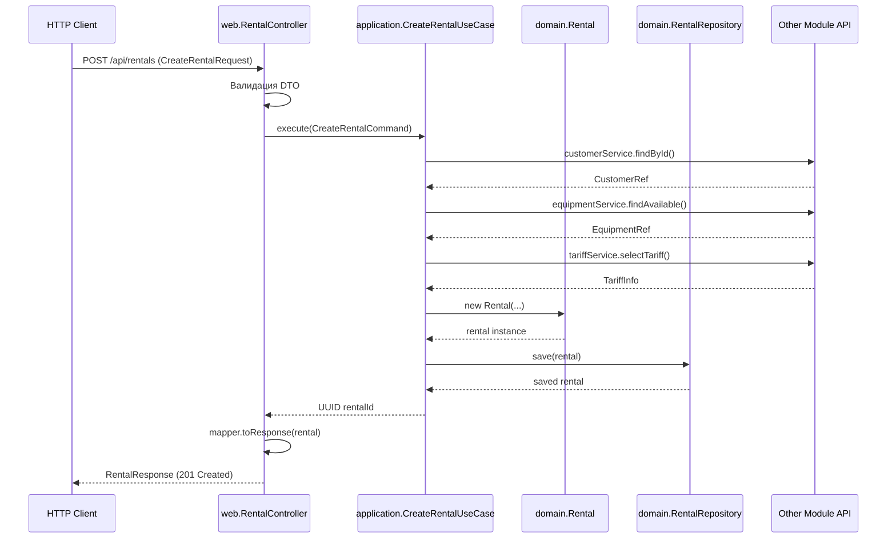

# Детальная структура модуля на примере Rental

## Общая концепция слоев

Каждый модуль в Spring Modulith следует многоуровневой архитектуре с четкими границами:

```
┌─────────────────────────────────────────────┐
│              web (REST API)                 │  ← Входная точка (HTTP)
├─────────────────────────────────────────────┤
│         application (Use Cases)             │  ← Бизнес-сценарии
├─────────────────────────────────────────────┤
│      domain (Entities & Business Logic)     │  ← Бизнес-логика
├─────────────────────────────────────────────┤
│        api (Public Interface)               │  ← Интерфейс для других модулей
└─────────────────────────────────────────────┘
```

---

## Полная структура модуля Rental

```
com.github.jenkaby.bikerental.rental/
│
├── package-info.java                    # Объявление модуля
│
├── api/                                 # PUBLIC API (для других модулей)
│   ├── RentalInfo.java                  # DTO для передачи данных
│   ├── RentalQuery.java                 # DTO запроса
│   └── event/                           # Доменные события
│       ├── RentalStarted.java
│       ├── RentalCompleted.java
│       └── RentalCancelled.java
│
├── domain/                              # БИЗНЕС-ЛОГИКА (internal)
│   ├── Rental.java                      # Агрегат (JPA Entity)
│   ├── RentalStatus.java                # Enum
│   ├── RentalRepository.java            # Repository интерфейс
│   └── RentalCostDetails.java           # Value Object
│
├── application/                         # USE CASES (internal)
│   ├── CreateRentalUseCase.java         # Сценарий создания
│   ├── StartRentalUseCase.java          # Сценарий запуска
│   ├── ReturnEquipmentUseCase.java      # Сценарий возврата
│   ├── CancelRentalUseCase.java         # Сценарий отмены
│   └── RentalQueryService.java          # Запросы (CQRS read)
│
└── web/                                 # REST CONTROLLERS (internal)
    ├── RentalController.java            # CRUD + commands
    ├── dto/
    │   ├── CreateRentalRequest.java     # Request DTO
    │   ├── StartRentalRequest.java
    │   ├── ReturnEquipmentRequest.java
    │   └── RentalResponse.java          # Response DTO
    └── mapper/
        └── RentalMapper.java            # Маппинг между domain и web DTO
```

---

## 1. Слой API (Public Interface)

**Назначение:** Публичный контракт модуля для других модулей

**Характеристики:**

- Все классы в `api/` доступны другим модулям
- Не содержат реализации, только интерфейсы и DTO
- Не должны меняться часто (stability)

### Пример 1: RentalInfo.java (DTO для других модулей)

```java
package com.github.jenkaby.bikerental.rental.api;

import java.time.LocalDateTime;
import java.util.UUID;

/**
 * Публичное представление аренды для других модулей.
 * Не содержит деталей реализации.
 */
public record RentalInfo(
    UUID rentalId,
    UUID customerId,
    UUID equipmentId,
    String status,
    LocalDateTime startedAt,
    LocalDateTime expectedReturnAt,
    LocalDateTime actualReturnAt
) {
}
```

### Пример 2: RentalStarted.java (Event)

```java
package com.github.jenkaby.bikerental.rental.api.event;

import org.springframework.modulith.ApplicationModuleListener;
import java.math.BigDecimal;
import java.time.LocalDateTime;
import java.util.UUID;

/**
 * Событие публикуется при запуске аренды.
 * Другие модули (например, Finance) подписываются на него.
 */
public record RentalStarted(
    UUID rentalId,
    UUID customerId,
    UUID equipmentId,
    LocalDateTime startedAt,
    BigDecimal prepaidAmount,
    LocalDateTime occurredAt
) {
}
```

**Использование другим модулем (Finance):**

```java
package com.github.jenkaby.bikerental.finance.application;

import com.github.jenkaby.bikerental.rental.api.event.RentalStarted;
import org.springframework.modulith.ApplicationModuleListener;

@Service
class RentalEventHandler {
    
    @ApplicationModuleListener
    void on(RentalStarted event) {
        // Finance модуль реагирует на событие
        paymentService.recordPrepayment(
            event.rentalId(),
            event.prepaidAmount(),
            PaymentType.PREPAYMENT
        );
    }
}
```

---

## 2. Слой DOMAIN (Business Logic)

**Назначение:** Бизнес-логика и сущности

**Характеристики:**

- Содержит агрегаты (JPA entities)
- Не знает о web/REST API
- Не знает о других модулях
- Содержит основные бизнес-правила

### Пример 1: Rental.java (Aggregate Root)

```java
package com.github.jenkaby.bikerental.rental.domain;

import jakarta.persistence.*;
import java.math.BigDecimal;
import java.time.LocalDateTime;
import java.util.UUID;

/**
 * Агрегат "Аренда" - центральная сущность модуля.
 * Содержит бизнес-логику жизненного цикла аренды.
 */
@Entity
@Table(name = "rentals")
public class Rental {
    
    @Id
    private UUID id;
    
    private UUID customerId;
    private UUID equipmentId;
    private UUID tariffId;
    
    @Enumerated(EnumType.STRING)
    private RentalStatus status;
    
    private LocalDateTime startedAt;
    private LocalDateTime expectedReturnAt;
    private LocalDateTime actualReturnAt;
    
    private Integer plannedMinutes;
    private Integer actualMinutes;
    
    private BigDecimal prepaidAmount;
    private BigDecimal surchargeAmount;
    
    // Constructor
    protected Rental() {} // JPA требует
    
    public Rental(UUID customerId, UUID equipmentId, UUID tariffId, 
                  Integer plannedMinutes, BigDecimal prepaidAmount) {
        this.id = UUID.randomUUID();
        this.customerId = customerId;
        this.equipmentId = equipmentId;
        this.tariffId = tariffId;
        this.plannedMinutes = plannedMinutes;
        this.prepaidAmount = prepaidAmount;
        this.status = RentalStatus.DRAFT;
    }
    
    /**
     * Бизнес-метод: запуск аренды.
     * FR-RN-005: Установка времени начала
     */
    public void start(LocalDateTime now) {
        if (status != RentalStatus.DRAFT) {
            throw new IllegalStateException("Rental can only be started from DRAFT status");
        }
        this.startedAt = now;
        this.expectedReturnAt = now.plusMinutes(plannedMinutes);
        this.status = RentalStatus.ACTIVE;
    }
    
    /**
     * Бизнес-метод: завершение аренды.
     * FR-RN-006: Фиксация времени возврата
     */
    public void complete(LocalDateTime now, Integer actualMinutes, BigDecimal surcharge) {
        if (status != RentalStatus.ACTIVE) {
            throw new IllegalStateException("Only ACTIVE rental can be completed");
        }
        this.actualReturnAt = now;
        this.actualMinutes = actualMinutes;
        this.surchargeAmount = surcharge;
        this.status = RentalStatus.COMPLETED;
    }
    
    /**
     * Бизнес-метод: отмена аренды.
     * FR-RN-008: Отмена в течение 10 минут
     */
    public boolean canBeCancelled(LocalDateTime now) {
        if (status != RentalStatus.ACTIVE) {
            return false;
        }
        // Проверка 10-минутного окна
        return startedAt.plusMinutes(10).isAfter(now);
    }
    
    public void cancel() {
        if (status != RentalStatus.ACTIVE) {
            throw new IllegalStateException("Only ACTIVE rental can be cancelled");
        }
        this.status = RentalStatus.CANCELLED;
    }
    
    // Getters
    public UUID getId() { return id; }
    public UUID getCustomerId() { return customerId; }
    public UUID getEquipmentId() { return equipmentId; }
    public RentalStatus getStatus() { return status; }
    public LocalDateTime getStartedAt() { return startedAt; }
    public LocalDateTime getExpectedReturnAt() { return expectedReturnAt; }
    public LocalDateTime getActualReturnAt() { return actualReturnAt; }
    public BigDecimal getPrepaidAmount() { return prepaidAmount; }
    public BigDecimal getSurchargeAmount() { return surchargeAmount; }
    public Integer getPlannedMinutes() { return plannedMinutes; }
}
```

### Пример 2: RentalStatus.java (Enum)

```java
package com.github.jenkaby.bikerental.rental.domain;

/**
 * Статусы жизненного цикла аренды
 */
public enum RentalStatus {
    DRAFT,      // Создана, но не запущена
    ACTIVE,     // Запущена (оборудование у клиента)
    COMPLETED,  // Завершена (оборудование возвращено)
    CANCELLED   // Отменена
}
```

### Пример 3: RentalRepository.java (Repository Interface)

```java
package com.github.jenkaby.bikerental.rental.domain;

import org.springframework.data.jpa.repository.JpaRepository;
import java.util.List;
import java.util.UUID;

/**
 * Репозиторий для работы с арендами.
 * Spring Data JPA автоматически создаст реализацию.
 */
interface RentalRepository extends JpaRepository<Rental, UUID> {
    
    List<Rental> findByStatus(RentalStatus status);
    
    List<Rental> findByCustomerId(UUID customerId);
    
    List<Rental> findByEquipmentIdAndStatus(UUID equipmentId, RentalStatus status);
}
```

**Важно:** `RentalRepository` НЕ публичный (без `public`), т.к. он нужен только внутри модуля.

---

## 3. Слой APPLICATION (Use Cases)

**Назначение:** Оркестрация бизнес-сценариев

**Характеристики:**

- Координирует работу domain объектов
- Вызывает API других модулей
- Публикует события
- Транзакционные границы (`@Transactional`)
- Реализует конкретные функциональные требования

### Пример 1: CreateRentalUseCase.java

```java
package com.github.jenkaby.bikerental.rental.application;

import com.github.jenkaby.bikerental.client.api.CustomerLookupService;
import com.github.jenkaby.bikerental.equipment.api.EquipmentAvailabilityService;
import com.github.jenkaby.bikerental.equipment.api.EquipmentRef;
import com.github.jenkaby.bikerental.tariff.api.TariffSelectionService;
import com.github.jenkaby.bikerental.tariff.api.TariffInfo;
import com.github.jenkaby.bikerental.rental.domain.*;
import org.springframework.stereotype.Service;
import org.springframework.transaction.annotation.Transactional;

import java.math.BigDecimal;
import java.util.UUID;

/**
 * FR-RN-001: Создание записи аренды
 * 
 * Координирует:
 * 1. Проверку существования клиента
 * 2. Проверку доступности оборудования
 * 3. Подбор тарифа
 * 4. Создание rental entity
 */
@Service
public class CreateRentalUseCase {
    
    private final RentalRepository rentalRepository;
    private final CustomerLookupService customerService;       // API client модуля
    private final EquipmentAvailabilityService equipmentService; // API equipment модуля
    private final TariffSelectionService tariffService;        // API tariff модуля
    
    public CreateRentalUseCase(
        RentalRepository rentalRepository,
        CustomerLookupService customerService,
        EquipmentAvailabilityService equipmentService,
        TariffSelectionService tariffService
    ) {
        this.rentalRepository = rentalRepository;
        this.customerService = customerService;
        this.equipmentService = equipmentService;
        this.tariffService = tariffService;
    }
    
    @Transactional
    public UUID execute(CreateRentalCommand command) {
        // 1. Проверка клиента (вызов API другого модуля)
        var customer = customerService.findById(command.customerId())
            .orElseThrow(() -> new CustomerNotFoundException(command.customerId()));
        
        // 2. Проверка доступности оборудования (вызов API другого модуля)
        EquipmentRef equipment = equipmentService.findAvailableByNumber(command.equipmentNumber())
            .orElseThrow(() -> new EquipmentNotAvailableException(command.equipmentNumber()));
        
        // 3. Автоматический подбор тарифа (вызов API другого модуля)
        // FR-TR-002: Автоподбор тарифа
        TariffInfo tariff = tariffService.selectTariff(
            equipment.type(),
            command.rentalPeriod()
        );
        
        // 4. Расчет предварительной стоимости
        Integer plannedMinutes = command.rentalPeriod().toMinutes();
        BigDecimal prepaidAmount = tariff.basePrice();
        
        // 5. Создание аренды (domain logic)
        Rental rental = new Rental(
            customer.id(),
            equipment.id(),
            tariff.id(),
            plannedMinutes,
            prepaidAmount
        );
        
        // 6. Сохранение
        rentalRepository.save(rental);
        
        return rental.getId();
    }
    
    /**
     * Command паттерн для входных данных
     */
    public record CreateRentalCommand(
        UUID customerId,
        String equipmentNumber,
        RentalPeriod rentalPeriod
    ) {}
    
    public enum RentalPeriod {
        HOUR_1(60),
        HOUR_2(120),
        DAY(1440);
        
        private final int minutes;
        
        RentalPeriod(int minutes) {
            this.minutes = minutes;
        }
        
        public int toMinutes() {
            return minutes;
        }
    }
}
```

### Пример 2: StartRentalUseCase.java

```java
package com.github.jenkaby.bikerental.rental.application;

import com.github.jenkaby.bikerental.rental.api.event.RentalStarted;
import com.github.jenkaby.bikerental.rental.domain.*;
import org.springframework.context.ApplicationEventPublisher;
import org.springframework.stereotype.Service;
import org.springframework.transaction.annotation.Transactional;

import java.time.LocalDateTime;
import java.util.UUID;

/**
 * FR-RN-005: Запуск аренды после внесения предоплаты
 * 
 * Публикует событие RentalStarted для других модулей (Finance, Equipment)
 */
@Service
public class StartRentalUseCase {
    
    private final RentalRepository rentalRepository;
    private final ApplicationEventPublisher eventPublisher;
    
    public StartRentalUseCase(
        RentalRepository rentalRepository,
        ApplicationEventPublisher eventPublisher
    ) {
        this.rentalRepository = rentalRepository;
        this.eventPublisher = eventPublisher;
    }
    
    @Transactional
    public void execute(StartRentalCommand command) {
        // 1. Загрузка аренды
        Rental rental = rentalRepository.findById(command.rentalId())
            .orElseThrow(() -> new RentalNotFoundException(command.rentalId()));
        
        // 2. Бизнес-логика старта (domain method)
        LocalDateTime now = LocalDateTime.now();
        rental.start(now);
        
        // 3. Сохранение
        rentalRepository.save(rental);
        
        // 4. Публикация события для других модулей
        RentalStarted event = new RentalStarted(
            rental.getId(),
            rental.getCustomerId(),
            rental.getEquipmentId(),
            rental.getStartedAt(),
            rental.getPrepaidAmount(),
            LocalDateTime.now()
        );
        eventPublisher.publishEvent(event);
    }
    
    public record StartRentalCommand(UUID rentalId) {}
}
```

### Пример 3: ReturnEquipmentUseCase.java (самый сложный)

```java
package com.github.jenkaby.bikerental.rental.application;

import com.github.jenkaby.bikerental.rental.api.event.RentalCompleted;
import com.github.jenkaby.bikerental.rental.domain.*;
import com.github.jenkaby.bikerental.tariff.api.RentalCostCalculator;
import com.github.jenkaby.bikerental.tariff.api.RentalCostDetails;
import org.springframework.context.ApplicationEventPublisher;
import org.springframework.stereotype.Service;
import org.springframework.transaction.annotation.Transactional;

import java.time.LocalDateTime;
import java.util.UUID;

/**
 * FR-RN-006: Возврат оборудования с расчетом стоимости
 * FR-RN-007: Расчет времени аренды
 * FR-TR-002: Расчет стоимости
 * FR-TR-003: Правило "прощения"
 * FR-TR-004: Расчет доплаты
 */
@Service
public class ReturnEquipmentUseCase {
    
    private final RentalRepository rentalRepository;
    private final RentalCostCalculator costCalculator;  // API tariff модуля
    private final ApplicationEventPublisher eventPublisher;
    
    public ReturnEquipmentUseCase(
        RentalRepository rentalRepository,
        RentalCostCalculator costCalculator,
        ApplicationEventPublisher eventPublisher
    ) {
        this.rentalRepository = rentalRepository;
        this.costCalculator = costCalculator;
        this.eventPublisher = eventPublisher;
    }
    
    @Transactional
    public ReturnResult execute(ReturnEquipmentCommand command) {
        // 1. Загрузка аренды
        Rental rental = rentalRepository.findById(command.rentalId())
            .orElseThrow(() -> new RentalNotFoundException(command.rentalId()));
        
        LocalDateTime now = LocalDateTime.now();
        
        // 2. Расчет фактического времени
        long actualMinutes = java.time.Duration.between(rental.getStartedAt(), now)
            .toMinutes();
        
        // 3. Расчет стоимости через Tariff модуль (с бизнес-правилами)
        RentalCostDetails costDetails = costCalculator.calculate(
            rental.getTariffId(),
            rental.getPlannedMinutes(),
            (int) actualMinutes
        );
        
        // 4. Завершение аренды (domain method)
        rental.complete(now, costDetails.actualMinutes(), costDetails.surcharge());
        
        // 5. Сохранение
        rentalRepository.save(rental);
        
        // 6. Публикация события
        RentalCompleted event = new RentalCompleted(
            rental.getId(),
            rental.getEquipmentId(),
            rental.getActualReturnAt(),
            costDetails.surcharge(),
            LocalDateTime.now()
        );
        eventPublisher.publishEvent(event);
        
        // 7. Возврат результата
        return new ReturnResult(
            rental.getId(),
            costDetails.actualMinutes(),
            costDetails.isForgiven(),
            costDetails.surcharge()
        );
    }
    
    public record ReturnEquipmentCommand(UUID rentalId) {}
    
    public record ReturnResult(
        UUID rentalId,
        int actualMinutes,
        boolean overtimeForgiven,
        BigDecimal surcharge
    ) {}
}
```

---

## 4. Слой WEB (REST Controllers)

**Назначение:** HTTP API (REST endpoints)

**Характеристики:**

- Преобразование HTTP запросов в команды/запросы
- Валидация входных данных
- Обработка ошибок
- Не содержит бизнес-логики (только делегирование)

### Пример 1: RentalController.java

```java
package com.github.jenkaby.bikerental.rental.web;

import com.github.jenkaby.bikerental.rental.application.*;
import com.github.jenkaby.bikerental.rental.web.dto.*;
import com.github.jenkaby.bikerental.rental.web.mapper.RentalMapper;
import jakarta.validation.Valid;
import org.springframework.http.HttpStatus;
import org.springframework.http.ResponseEntity;
import org.springframework.web.bind.annotation.*;

import java.util.List;
import java.util.UUID;

/**
 * REST API для управления арендами.
 * Версионирование через Content-Type (NFR-113).
 */
@RestController
@RequestMapping("/api/rentals")
public class RentalController {
    
    private final CreateRentalUseCase createRentalUseCase;
    private final StartRentalUseCase startRentalUseCase;
    private final ReturnEquipmentUseCase returnEquipmentUseCase;
    private final CancelRentalUseCase cancelRentalUseCase;
    private final RentalQueryService rentalQueryService;
    private final RentalMapper mapper;
    
    public RentalController(
        CreateRentalUseCase createRentalUseCase,
        StartRentalUseCase startRentalUseCase,
        ReturnEquipmentUseCase returnEquipmentUseCase,
        CancelRentalUseCase cancelRentalUseCase,
        RentalQueryService rentalQueryService,
        RentalMapper mapper
    ) {
        this.createRentalUseCase = createRentalUseCase;
        this.startRentalUseCase = startRentalUseCase;
        this.returnEquipmentUseCase = returnEquipmentUseCase;
        this.cancelRentalUseCase = cancelRentalUseCase;
        this.rentalQueryService = rentalQueryService;
        this.mapper = mapper;
    }
    
    /**
     * FR-RN-001: Создание записи аренды
     * POST /api/rentals
     */
    @PostMapping
    public ResponseEntity<RentalResponse> createRental(
        @Valid @RequestBody CreateRentalRequest request
    ) {
        var command = new CreateRentalUseCase.CreateRentalCommand(
            request.customerId(),
            request.equipmentNumber(),
            request.rentalPeriod()
        );
        
        UUID rentalId = createRentalUseCase.execute(command);
        
        RentalResponse response = rentalQueryService.findById(rentalId)
            .map(mapper::toResponse)
            .orElseThrow();
        
        return ResponseEntity.status(HttpStatus.CREATED).body(response);
    }
    
    /**
     * FR-RN-005: Запуск аренды
     * POST /api/rentals/{id}/start
     */
    @PostMapping("/{id}/start")
    public ResponseEntity<Void> startRental(@PathVariable UUID id) {
        var command = new StartRentalUseCase.StartRentalCommand(id);
        startRentalUseCase.execute(command);
        return ResponseEntity.ok().build();
    }
    
    /**
     * FR-RN-006: Возврат оборудования
     * POST /api/rentals/{id}/return
     */
    @PostMapping("/{id}/return")
    public ResponseEntity<ReturnEquipmentResponse> returnEquipment(
        @PathVariable UUID id
    ) {
        var command = new ReturnEquipmentUseCase.ReturnEquipmentCommand(id);
        var result = returnEquipmentUseCase.execute(command);
        
        var response = new ReturnEquipmentResponse(
            result.rentalId(),
            result.actualMinutes(),
            result.overtimeForgiven(),
            result.surcharge()
        );
        
        return ResponseEntity.ok(response);
    }
    
    /**
     * FR-RN-008: Отмена аренды
     * POST /api/rentals/{id}/cancel
     */
    @PostMapping("/{id}/cancel")
    public ResponseEntity<Void> cancelRental(@PathVariable UUID id) {
        var command = new CancelRentalUseCase.CancelRentalCommand(id);
        cancelRentalUseCase.execute(command);
        return ResponseEntity.ok().build();
    }
    
    /**
     * FR-RN-009: Список активных аренд
     * GET /api/rentals/active
     */
    @GetMapping("/active")
    public ResponseEntity<List<RentalResponse>> getActiveRentals() {
        List<RentalResponse> rentals = rentalQueryService.findActive()
            .stream()
            .map(mapper::toResponse)
            .toList();
        
        return ResponseEntity.ok(rentals);
    }
    
    /**
     * Получение аренды по ID
     * GET /api/rentals/{id}
     */
    @GetMapping("/{id}")
    public ResponseEntity<RentalResponse> getRental(@PathVariable UUID id) {
        return rentalQueryService.findById(id)
            .map(mapper::toResponse)
            .map(ResponseEntity::ok)
            .orElse(ResponseEntity.notFound().build());
    }
}
```

### Пример 2: CreateRentalRequest.java (DTO)

```java
package com.github.jenkaby.bikerental.rental.web.dto;

import com.github.jenkaby.bikerental.rental.application.CreateRentalUseCase.RentalPeriod;
import jakarta.validation.constraints.NotNull;
import java.util.UUID;

/**
 * DTO для HTTP запроса создания аренды.
 * Валидация на уровне контроллера.
 */
public record CreateRentalRequest(
    @NotNull(message = "Customer ID is required")
    UUID customerId,
    
    @NotNull(message = "Equipment number is required")
    String equipmentNumber,
    
    @NotNull(message = "Rental period is required")
    RentalPeriod rentalPeriod
) {
}
```

### Пример 3: RentalResponse.java (DTO)

```java
package com.github.jenkaby.bikerental.rental.web.dto;

import java.math.BigDecimal;
import java.time.LocalDateTime;
import java.util.UUID;

/**
 * DTO для HTTP ответа с информацией об аренде.
 */
public record RentalResponse(
    UUID id,
    UUID customerId,
    UUID equipmentId,
    String status,
    LocalDateTime startedAt,
    LocalDateTime expectedReturnAt,
    LocalDateTime actualReturnAt,
    Integer plannedMinutes,
    Integer actualMinutes,
    BigDecimal prepaidAmount,
    BigDecimal surchargeAmount,
    BigDecimal totalAmount
) {
}
```

### Пример 4: RentalMapper.java (Маппер)

```java
package com.github.jenkaby.bikerental.rental.web.mapper;

import com.github.jenkaby.bikerental.rental.domain.Rental;
import com.github.jenkaby.bikerental.rental.web.dto.RentalResponse;
import org.springframework.stereotype.Component;

import java.math.BigDecimal;

/**
 * Маппер между domain сущностями и web DTO.
 */
@Component
public class RentalMapper {
    
    public RentalResponse toResponse(Rental rental) {
        BigDecimal totalAmount = rental.getPrepaidAmount();
        if (rental.getSurchargeAmount() != null) {
            totalAmount = totalAmount.add(rental.getSurchargeAmount());
        }
        
        return new RentalResponse(
            rental.getId(),
            rental.getCustomerId(),
            rental.getEquipmentId(),
            rental.getStatus().name(),
            rental.getStartedAt(),
            rental.getExpectedReturnAt(),
            rental.getActualReturnAt(),
            rental.getPlannedMinutes(),
            rental.getActualMinutes(),
            rental.getPrepaidAmount(),
            rental.getSurchargeAmount(),
            totalAmount
        );
    }
}
```

---

## 5. Package-info.java (Объявление модуля)

```java
/**
 * Модуль управления арендой оборудования.
 * 
 * Реализует функциональные требования FR-RN-001 - FR-RN-009.
 * 
 * Публичный API:
 * - {@link com.github.jenkaby.bikerental.rental.api.RentalInfo}
 * - {@link com.github.jenkaby.bikerental.rental.api.event.RentalStarted}
 * - {@link com.github.jenkaby.bikerental.rental.api.event.RentalCompleted}
 * - {@link com.github.jenkaby.bikerental.rental.api.event.RentalCancelled}
 * 
 * Внутренняя структура (internal):
 * - domain: Rental entity и бизнес-логика
 * - application: Use cases (CreateRental, StartRental, ReturnEquipment, etc.)
 * - web: REST API контроллеры
 */
@ApplicationModule(
    displayName = "Rental Management",
    allowedDependencies = {"client", "equipment", "tariff"}
)
package com.github.jenkaby.bikerental.rental;

import org.springframework.modulith.ApplicationModule;
```

---

## Сравнительная таблица слоев

| Слой | Видимость | Зависимости | Содержит | Не содержит |

|------|-----------|-------------|----------|-------------|

| **api** | Public | Нет зависимостей | DTO, Events, Interfaces | Реализации, JPA entities |

| **domain** | Internal | Только на shared | Entities, Value Objects, Business logic | HTTP, Events publication |

| **application** | Internal | api других модулей, domain | Use cases, Orchestration | HTTP, Controllers |

| **web** | Internal | application, domain (для DTO) | Controllers, Request/Response DTO | Business logic |

---

## Поток данных через слои



---

## Ключевые принципы

### 1. Разделение ответственности

- **api**: Контракт для внешних модулей
- **domain**: Бизнес-правила и сущности
- **application**: Оркестрация (use cases)
- **web**: HTTP адаптер

### 2. Направление зависимостей

```
web → application → domain
         ↓
      api (других модулей)
```

### 3. Правила именования

- **Entities**: `{Noun}` — имя сущности (Rental, Customer, Equipment)
- **Use Cases**: `{Verb}{Noun}UseCase` (CreateRentalUseCase)
- **Events**: `{Noun}{PastTense}` (RentalStarted)
- **DTOs**: `{Purpose}{Type}` (CreateRentalRequest, RentalResponse)
- **Repositories**: `{Entity}Repository` (RentalRepository)
- **Value Objects**: `{Noun}` — описательное имя (Money, TimeRange, Address)

### 4. Тестирование по слоям

- **Domain**: Unit тесты (JUnit, Mockito)
- **Application**: Integration тесты (Spring Boot Test)
- **Web**: REST API тесты (MockMvc, RestAssured)
- **Cross-module**: Cucumber component тесты (NFR-052)

### 5. Абстракция от типа базы данных (Repository Pattern)

**Проблема:** В приведенных примерах используется JPA (SQL база). Что будет при переходе на MongoDB или другую NoSQL
базу?

**Решение:** Repository Pattern обеспечивает абстракцию от конкретной технологии хранения данных.

#### 5.1 Правильная структура с абстракцией

```
rental/
├── domain/
│   ├── Rental.java                    # POJO без аннотаций БД
│   ├── RentalRepository.java          # Interface (domain contract)
│   └── RentalStatus.java
│
└── infrastructure/                    # Детали реализации БД
    ├── persistence/
    │   ├── jpa/
    │   │   ├── RentalJpaEntity.java   # JPA entity с аннотациями
    │   │   ├── RentalJpaRepository.java
    │   │   └── RentalRepositoryJpaAdapter.java
    │   │
    │   └── mongodb/  (альтернативная реализация)
    │       ├── RentalMongoDocument.java
    │       ├── RentalMongoRepository.java
    │       └── RentalRepositoryMongoAdapter.java
```

#### 5.2 Пример чистого Domain без зависимости от JPA

**domain/Rental.java** (чистый POJO):

```java
package com.github.jenkaby.bikerental.rental.domain;

import java.math.BigDecimal;
import java.time.LocalDateTime;
import java.util.UUID;

/**
 * Агрегат "Аренда" - БЕЗ привязки к конкретной БД.
 * Только бизнес-логика.
 */
public class Rental {
    
    private final UUID id;
    private final UUID customerId;
    private final UUID equipmentId;
    private final UUID tariffId;
    
    private RentalStatus status;
    private LocalDateTime startedAt;
    private LocalDateTime expectedReturnAt;
    private LocalDateTime actualReturnAt;
    
    private final Integer plannedMinutes;
    private Integer actualMinutes;
    
    private final BigDecimal prepaidAmount;
    private BigDecimal surchargeAmount;
    
    // Constructor
    public Rental(UUID customerId, UUID equipmentId, UUID tariffId, 
                  Integer plannedMinutes, BigDecimal prepaidAmount) {
        this.id = UUID.randomUUID();
        this.customerId = customerId;
        this.equipmentId = equipmentId;
        this.tariffId = tariffId;
        this.plannedMinutes = plannedMinutes;
        this.prepaidAmount = prepaidAmount;
        this.status = RentalStatus.DRAFT;
    }
    
    // Для восстановления из БД
    public Rental(UUID id, UUID customerId, UUID equipmentId, UUID tariffId,
                  RentalStatus status, LocalDateTime startedAt, 
                  LocalDateTime expectedReturnAt, LocalDateTime actualReturnAt,
                  Integer plannedMinutes, Integer actualMinutes,
                  BigDecimal prepaidAmount, BigDecimal surchargeAmount) {
        this.id = id;
        this.customerId = customerId;
        this.equipmentId = equipmentId;
        this.tariffId = tariffId;
        this.status = status;
        this.startedAt = startedAt;
        this.expectedReturnAt = expectedReturnAt;
        this.actualReturnAt = actualReturnAt;
        this.plannedMinutes = plannedMinutes;
        this.actualMinutes = actualMinutes;
        this.prepaidAmount = prepaidAmount;
        this.surchargeAmount = surchargeAmount;
    }
    
    // Бизнес-методы остаются без изменений
    public void start(LocalDateTime now) {
        if (status != RentalStatus.DRAFT) {
            throw new IllegalStateException("Rental can only be started from DRAFT status");
        }
        this.startedAt = now;
        this.expectedReturnAt = now.plusMinutes(plannedMinutes);
        this.status = RentalStatus.ACTIVE;
    }
    
    public void complete(LocalDateTime now, Integer actualMinutes, BigDecimal surcharge) {
        if (status != RentalStatus.ACTIVE) {
            throw new IllegalStateException("Only ACTIVE rental can be completed");
        }
        this.actualReturnAt = now;
        this.actualMinutes = actualMinutes;
        this.surchargeAmount = surcharge;
        this.status = RentalStatus.COMPLETED;
    }
    
    // Getters...
    public UUID getId() { return id; }
    public UUID getCustomerId() { return customerId; }
    public UUID getEquipmentId() { return equipmentId; }
    public UUID getTariffId() { return tariffId; }
    public RentalStatus getStatus() { return status; }
    public LocalDateTime getStartedAt() { return startedAt; }
    public LocalDateTime getExpectedReturnAt() { return expectedReturnAt; }
    public LocalDateTime getActualReturnAt() { return actualReturnAt; }
    public Integer getPlannedMinutes() { return plannedMinutes; }
    public Integer getActualMinutes() { return actualMinutes; }
    public BigDecimal getPrepaidAmount() { return prepaidAmount; }
    public BigDecimal getSurchargeAmount() { return surchargeAmount; }
}
```

**domain/RentalRepository.java** (интерфейс без Spring Data):

```java
package com.github.jenkaby.bikerental.rental.domain;

import java.util.List;
import java.util.Optional;
import java.util.UUID;

/**
 * Repository интерфейс в терминах domain модели.
 * НЕ зависит от Spring Data JPA или MongoDB.
 */
public interface RentalRepository {
    
    Rental save(Rental rental);
    
    Optional<Rental> findById(UUID id);
    
    List<Rental> findByStatus(RentalStatus status);
    
    List<Rental> findByCustomerId(UUID customerId);
    
    List<Rental> findActiveByEquipmentId(UUID equipmentId);
    
    void delete(Rental rental);
}
```

#### 5.3 JPA реализация (в infrastructure)

**infrastructure/persistence/jpa/RentalJpaEntity.java**:

```java
package com.github.jenkaby.bikerental.rental.infrastructure.persistence.jpa;

import jakarta.persistence.*;
import java.math.BigDecimal;
import java.time.LocalDateTime;
import java.util.UUID;

/**
 * JPA Entity - технические детали персистентности.
 * НЕ используется в domain или application слоях.
 */
@Entity
@Table(name = "rentals")
class RentalJpaEntity {
    
    @Id
    private UUID id;
    
    @Column(name = "customer_id", nullable = false)
    private UUID customerId;
    
    @Column(name = "equipment_id", nullable = false)
    private UUID equipmentId;
    
    @Column(name = "tariff_id", nullable = false)
    private UUID tariffId;
    
    @Enumerated(EnumType.STRING)
    @Column(nullable = false)
    private String status;
    
    @Column(name = "started_at")
    private LocalDateTime startedAt;
    
    @Column(name = "expected_return_at")
    private LocalDateTime expectedReturnAt;
    
    @Column(name = "actual_return_at")
    private LocalDateTime actualReturnAt;
    
    @Column(name = "planned_minutes", nullable = false)
    private Integer plannedMinutes;
    
    @Column(name = "actual_minutes")
    private Integer actualMinutes;
    
    @Column(name = "prepaid_amount", nullable = false)
    private BigDecimal prepaidAmount;
    
    @Column(name = "surcharge_amount")
    private BigDecimal surchargeAmount;
    
    // Getters/Setters для JPA
}
```

**infrastructure/persistence/jpa/RentalJpaRepository.java**:

```java
package com.github.jenkaby.bikerental.rental.infrastructure.persistence.jpa;

import org.springframework.data.jpa.repository.JpaRepository;
import org.springframework.data.jpa.repository.Query;
import java.util.List;
import java.util.UUID;

/**
 * Spring Data JPA repository.
 * Работает с RentalJpaEntity.
 */
interface RentalJpaRepository extends JpaRepository<RentalJpaEntity, UUID> {
    
    List<RentalJpaEntity> findByStatus(String status);
    
    List<RentalJpaEntity> findByCustomerId(UUID customerId);
    
    @Query("SELECT r FROM RentalJpaEntity r WHERE r.equipmentId = :equipmentId AND r.status = 'ACTIVE'")
    List<RentalJpaEntity> findActiveByEquipmentId(UUID equipmentId);
}
```

**infrastructure/persistence/jpa/RentalRepositoryJpaAdapter.java** (маппинг):

```java
package com.github.jenkaby.bikerental.rental.infrastructure.persistence.jpa;

import com.github.jenkaby.bikerental.rental.domain.*;
import org.springframework.stereotype.Repository;

import java.util.List;
import java.util.Optional;
import java.util.UUID;

/**
 * Адаптер между domain интерфейсом и JPA реализацией.
 * Преобразует domain Rental <-> JpaEntity.
 */
@Repository
class RentalRepositoryJpaAdapter implements RentalRepository {
    
    private final RentalJpaRepository jpaRepository;
    
    public RentalRepositoryJpaAdapter(RentalJpaRepository jpaRepository) {
        this.jpaRepository = jpaRepository;
    }
    
    @Override
    public Rental save(Rental rental) {
        RentalJpaEntity entity = toEntity(rental);
        RentalJpaEntity saved = jpaRepository.save(entity);
        return toDomain(saved);
    }
    
    @Override
    public Optional<Rental> findById(UUID id) {
        return jpaRepository.findById(id)
            .map(this::toDomain);
    }
    
    @Override
    public List<Rental> findByStatus(RentalStatus status) {
        return jpaRepository.findByStatus(status.name())
            .stream()
            .map(this::toDomain)
            .toList();
    }
    
    @Override
    public List<Rental> findByCustomerId(UUID customerId) {
        return jpaRepository.findByCustomerId(customerId)
            .stream()
            .map(this::toDomain)
            .toList();
    }
    
    @Override
    public List<Rental> findActiveByEquipmentId(UUID equipmentId) {
        return jpaRepository.findActiveByEquipmentId(equipmentId)
            .stream()
            .map(this::toDomain)
            .toList();
    }
    
    @Override
    public void delete(Rental rental) {
        jpaRepository.deleteById(rental.getId());
    }
    
    // Мапперы
    private RentalJpaEntity toEntity(Rental rental) {
        RentalJpaEntity entity = new RentalJpaEntity();
        entity.setId(rental.getId());
        entity.setCustomerId(rental.getCustomerId());
        entity.setEquipmentId(rental.getEquipmentId());
        entity.setTariffId(rental.getTariffId());
        entity.setStatus(rental.getStatus().name());
        entity.setStartedAt(rental.getStartedAt());
        entity.setExpectedReturnAt(rental.getExpectedReturnAt());
        entity.setActualReturnAt(rental.getActualReturnAt());
        entity.setPlannedMinutes(rental.getPlannedMinutes());
        entity.setActualMinutes(rental.getActualMinutes());
        entity.setPrepaidAmount(rental.getPrepaidAmount());
        entity.setSurchargeAmount(rental.getSurchargeAmount());
        return entity;
    }
    
    private Rental toDomain(RentalJpaEntity entity) {
        return new Rental(
            entity.getId(),
            entity.getCustomerId(),
            entity.getEquipmentId(),
            entity.getTariffId(),
            RentalStatus.valueOf(entity.getStatus()),
            entity.getStartedAt(),
            entity.getExpectedReturnAt(),
            entity.getActualReturnAt(),
            entity.getPlannedMinutes(),
            entity.getActualMinutes(),
            entity.getPrepaidAmount(),
            entity.getSurchargeAmount()
        );
    }
}
```

#### 5.4 MongoDB реализация (альтернатива)

**infrastructure/persistence/mongodb/RentalMongoDocument.java**:

```java
package com.github.jenkaby.bikerental.rental.infrastructure.persistence.mongodb;

import org.springframework.data.annotation.Id;
import org.springframework.data.mongodb.core.mapping.Document;
import java.math.BigDecimal;
import java.time.LocalDateTime;
import java.util.UUID;

@Document(collection = "rentals")
class RentalMongoDocument {
    
    @Id
    private String id;
    
    private UUID customerId;
    private UUID equipmentId;
    private UUID tariffId;
    private String status;
    private LocalDateTime startedAt;
    private LocalDateTime expectedReturnAt;
    private LocalDateTime actualReturnAt;
    private Integer plannedMinutes;
    private Integer actualMinutes;
    private BigDecimal prepaidAmount;
    private BigDecimal surchargeAmount;
    
    // Getters/Setters
}
```

**infrastructure/persistence/mongodb/RentalRepositoryMongoAdapter.java**:

```java
package com.github.jenkaby.bikerental.rental.infrastructure.persistence.mongodb;

import com.github.jenkaby.bikerental.rental.domain.*;
import org.springframework.context.annotation.Profile;
import org.springframework.stereotype.Repository;

/**
 * MongoDB реализация того же интерфейса RentalRepository.
 * Активируется через профиль Spring.
 */
@Repository
@Profile("mongodb")
class RentalRepositoryMongoAdapter implements RentalRepository {
    
    private final MongoTemplate mongoTemplate;
    
    public RentalRepositoryMongoAdapter(MongoTemplate mongoTemplate) {
        this.mongoTemplate = mongoTemplate;
    }
    
    @Override
    public Rental save(Rental rental) {
        RentalMongoDocument doc = toDocument(rental);
        RentalMongoDocument saved = mongoTemplate.save(doc);
        return toDomain(saved);
    }
    
    @Override
    public Optional<Rental> findById(UUID id) {
        RentalMongoDocument doc = mongoTemplate.findById(id.toString(), RentalMongoDocument.class);
        return Optional.ofNullable(doc).map(this::toDomain);
    }
    
    // Остальные методы с MongoDB Query...
    
    // Мапперы document <-> domain
}
```

#### 5.5 Преимущества такого подхода

**Плюсы:**

1. **Domain слой независим от БД** — можно тестировать без БД (in-memory реализация)
2. **Легкая смена БД** — достаточно создать новый adapter в `infrastructure/`
3. **Чистая архитектура** — domain не знает о технических деталях
4. **Тестируемость** — mock'ить `RentalRepository` проще, чем JPA entity

**Минусы:**

1. **Больше кода** — нужны мапперы между domain и JPA/Mongo
2. **Дублирование** — domain модель + persistence модель
3. **Сложность** — требует понимания паттернов DDD

#### 5.6 Упрощенный подход (для MVP)

Для быстрого старта (MVP) допустимо использовать JPA аннотации прямо в domain:

```java
// Компромиссный вариант: JPA аннотации в domain
@Entity
@Table(name = "rentals")
public class Rental {
    @Id
    private UUID id;
    // ...
}
```

**Когда переходить на полную абстракцию:**

- При необходимости смены БД
- При сложной domain логике
- При построении микросервисов
- Для строгого DDD подхода

#### 5.7 Рекомендация для BikeRent

**Для Phase 1 (MVP):**

- Используйте JPA аннотации в domain (как в примерах выше)
- Быстрый старт, меньше кода

**Для Phase 2-3:**

- Рефакторинг на Repository Pattern с адаптерами
- Если появится необходимость в NoSQL или множественных источниках данных

---

## Итого: Почему такая структура?

1. **Модульность** — каждый модуль независим и имеет четкие границы
2. **Тестируемость** — каждый слой тестируется отдельно
3. **Масштабируемость** — легко добавить новые use cases или endpoints
4. **Поддерживаемость** — понятная структура, легко найти нужный код
5. **Миграция** — при необходимости легко выделить модуль в микросервис