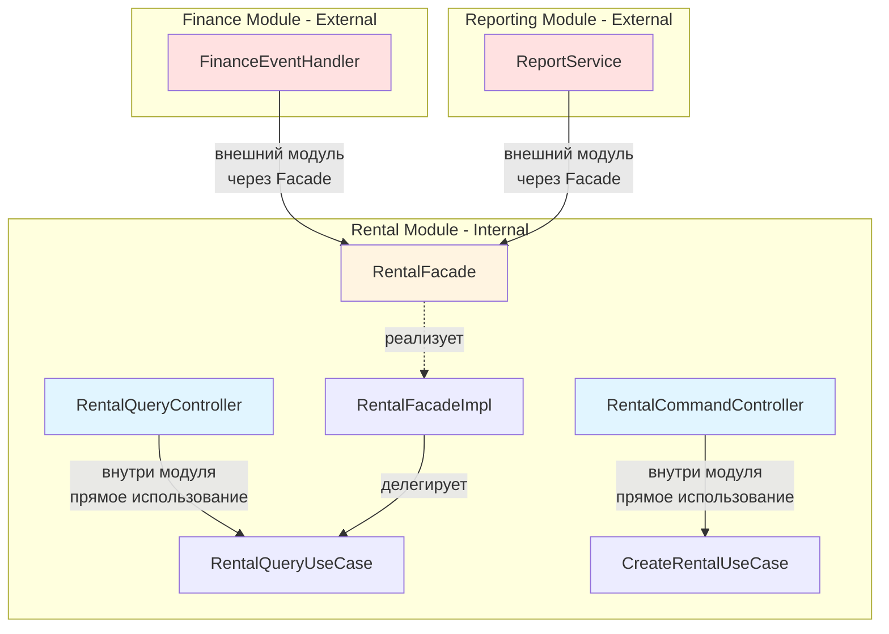

# Исправленная структура модуля Rental с документацией

## Исправление: Query Controller использует UseCase напрямую

**Проблема:** В предыдущей версии RentalQueryController использовал RentalFacade, что создавало избыточный слой
абстракции для внутреннего компонента модуля.

**Решение:** Query Controller должен использовать RentalQueryUseCase напрямую, т.к. находится внутри модуля Rental.
Facade используется только внешними модулями.

---

## Правила использования Facade vs UseCase

### Когда использовать UseCase напрямую

**Внутренние компоненты модуля Rental:**

- Controllers (Command и Query)
- Другие UseCase внутри модуля
- Application сервисы внутри модуля

**Причина:** Нет необходимости в дополнительном слое абстракции, т.к. все находится в одном модуле.

### Когда использовать Facade

**Внешние модули:**

- Finance модуль
- Reporting модуль
- Maintenance модуль
- Любые другие модули, которым нужен доступ к Rental

**Причина:** Facade - это публичный контракт модуля, обеспечивающий:

- Стабильность API (внутренняя реализация может меняться)
- Инкапсуляцию (скрывает детали реализации)
- Соблюдение границ модулей Spring Modulith

---

## Исправленная структура модуля Rental

```
com.github.jenkaby.bikerental.rental/
│
├── package-info.java                       # @ApplicationModule + @NamedInterfaces
│
├── RentalFacade.java                       # PUBLIC - только для других модулей
├── RentalInfo.java                         # PUBLIC - DTO для других модулей
│
├── event/                                  # PUBLIC (через @NamedInterface)
│   ├── RentalStarted.java
│   ├── RentalCompleted.java
│   └── RentalCancelled.java
│
├── internal/
│   │
│   ├── domain/
│   │   ├── model/
│   │   │   ├── Rental.java                 # Aggregate Root (чистый POJO)
│   │   │   ├── RentalStatus.java           # Enum
│   │   │   └── vo/                         # Value Objects
│   │   │       ├── RentTime.java
│   │   │       ├── PayAmount.java
│   │   │       ├── RentalId.java
│   │   │       └── CustomerId.java
│   │   │
│   │   └── repository/
│   │       └── RentalRepository.java       # Domain repository interface
│   │
│   ├── application/
│   │   ├── usecase/                        # UseCase интерфейсы
│   │   │   ├── CreateRentalUseCase.java
│   │   │   ├── StartRentalUseCase.java
│   │   │   ├── ReturnEquipmentUseCase.java
│   │   │   ├── CancelRentalUseCase.java
│   │   │   └── RentalQueryUseCase.java
│   │   │
│   │   ├── service/                        # Реализации UseCase
│   │   │   ├── CreateRentalService.java
│   │   │   ├── StartRentalService.java
│   │   │   ├── ReturnEquipmentService.java
│   │   │   ├── CancelRentalService.java
│   │   │   └── RentalQueryService.java
│   │   │
│   │   ├── port/                           # Ports (абстракции)
│   │   │   ├── DomainEventPublisher.java
│   │   │   └── ClockService.java
│   │   │
│   │   └── mapper/
│   │       └── RentalMapper.java           # MapStruct: domain ↔ Public DTO
│   │
│   ├── infrastructure/
│   │   ├── persistence/
│   │   │   ├── entity/
│   │   │   │   └── RentalJpaEntity.java
│   │   │   ├── repository/
│   │   │   │   └── RentalJpaRepository.java
│   │   │   ├── adapter/
│   │   │   │   └── RentalRepositoryAdapter.java
│   │   │   └── mapper/
│   │   │       └── RentalJpaMapper.java    # MapStruct: domain ↔ JPA
│   │   │
│   │   ├── event/
│   │   │   └── SpringDomainEventPublisher.java
│   │   │
│   │   └── time/
│   │       └── SystemClockService.java
│   │
│   └── web/
│       ├── command/                        # Command контроллеры
│       │   ├── RentalCommandController.java
│       │   ├── dto/
│       │   │   ├── CreateRentalRequest.java
│       │   │   ├── StartRentalRequest.java
│       │   │   ├── ReturnEquipmentRequest.java
│       │   │   └── CancelRentalRequest.java
│       │   └── mapper/
│       │       └── RentalCommandMapper.java
│       │
│       └── query/                          # Query контроллеры
│           ├── RentalQueryController.java  # ✅ Использует UseCase напрямую
│           ├── dto/
│           │   └── RentalResponse.java
│           └── mapper/
│               └── RentalQueryMapper.java
```

---

## Исправленный RentalQueryController

### RentalQueryController.java

```java
package com.github.jenkaby.bikerental.rental.internal.web.query;

import com.github.jenkaby.bikerental.rental.RentalInfo;
import com.github.jenkaby.bikerental.rental.internal.application.usecase.RentalQueryUseCase;
import com.github.jenkaby.bikerental.rental.internal.web.query.dto.RentalResponse;
import com.github.jenkaby.bikerental.rental.internal.web.query.mapper.RentalQueryMapper;

import org.springframework.http.ResponseEntity;
import org.springframework.web.bind.annotation.*;

import java.util.List;

/**
 * REST API для запросов (чтение данных об арендах).
 * 
 * Использует RentalQueryUseCase напрямую, т.к. находится внутри модуля Rental.
 * Facade (RentalFacade) используется только внешними модулями.
 * 
 * Endpoint согласно backend-architecture.md:
 * - GET /api/rentals/active
 */
@RestController
@RequestMapping("/api/rentals")
class RentalQueryController {
    
    private final RentalQueryUseCase rentalQueryUseCase;  // ✅ Прямое использование UseCase
    private final RentalQueryMapper mapper;
    
    RentalQueryController(RentalQueryUseCase rentalQueryUseCase, RentalQueryMapper mapper) {
        this.rentalQueryUseCase = rentalQueryUseCase;
        this.mapper = mapper;
    }
    
    /**
     * GET /api/rentals/active - Список активных аренд
     */
    @GetMapping("/active")
    public ResponseEntity<List<RentalResponse>> getActiveRentals() {
        List<RentalInfo> rentals = rentalQueryUseCase.findActiveRentals();  // ✅ Прямой вызов UseCase
        List<RentalResponse> responses = rentals.stream()
            .map(mapper::toResponse)
            .toList();
        return ResponseEntity.ok(responses);
    }
    
    /**
     * GET /api/rentals/{id} - Получение аренды по ID
     * (дополнительный endpoint для удобства)
     */
    @GetMapping("/{id}")
    public ResponseEntity<RentalResponse> getRental(@PathVariable Long id) {
        return rentalQueryUseCase.findById(id)  // ✅ Прямой вызов UseCase
            .map(mapper::toResponse)
            .map(ResponseEntity::ok)
            .orElse(ResponseEntity.notFound().build());
    }
}
```

---

## RentalFacade - только для внешних модулей

### RentalFacade.java

```java
package com.github.jenkaby.bikerental.rental;

import java.util.List;
import java.util.Optional;
import java.util.UUID;

/**
 * Публичный фасад модуля Rental.
 * 
 * Использование:
 * - ТОЛЬКО для внешних модулей (Finance, Reporting, Maintenance и т.д.)
 * - НЕ используется внутри модуля Rental (используйте UseCase напрямую)
 * 
 * Пример использования из Finance модуля:
 * <pre>
 * {@code
 * @Service
 * class RentalEventHandler {
 *     private final RentalFacade rentalFacade;  // ✅ Правильно для внешнего модуля
 *     
 *     void on(RentalStarted event) {
 *         RentalInfo rental = rentalFacade.findById(event.rentalId()).orElseThrow();
 *     }
 * }
 * }
 * </pre>
 */
public interface RentalFacade {
    
    /**
     * Найти аренду по ID.
     */
    Optional<RentalInfo> findById(Long rentalId);
    
    /**
     * Найти активные аренды.
     */
    List<RentalInfo> findActiveRentals();
    
    /**
     * Найти активную аренду по оборудованию.
     */
    Optional<RentalInfo> findActiveByEquipmentId(Long equipmentId);
    
    /**
     * Найти аренды клиента.
     */
    List<RentalInfo> findByCustomerId(UUID customerId);
}
```

### RentalFacadeImpl.java

```java
package com.github.jenkaby.bikerental.rental;

import com.github.jenkaby.bikerental.rental.internal.application.usecase.RentalQueryUseCase;
import org.springframework.stereotype.Service;

import java.util.List;
import java.util.Optional;
import java.util.UUID;

/**
 * Реализация фасада модуля Rental.
 * 
 * Делегирует вызовы RentalQueryUseCase.
 * Используется только внешними модулями через интерфейс RentalFacade.
 */
@Service
class RentalFacadeImpl implements RentalFacade {
    
    private final RentalQueryUseCase rentalQueryUseCase;
    
    RentalFacadeImpl(RentalQueryUseCase rentalQueryUseCase) {
        this.rentalQueryUseCase = rentalQueryUseCase;
    }
    
    @Override
    public Optional<RentalInfo> findById(Long rentalId) {
        return rentalQueryUseCase.findById(rentalId);
    }
    
    @Override
    public List<RentalInfo> findActiveRentals() {
        return rentalQueryUseCase.findActiveRentals();
    }
    
    @Override
    public Optional<RentalInfo> findActiveByEquipmentId(Long equipmentId) {
        return rentalQueryUseCase.findActiveByEquipmentId(equipmentId);
    }
    
    @Override
    public List<RentalInfo> findByCustomerId(UUID customerId) {
        return rentalQueryUseCase.findByCustomerId(customerId);
    }
}
```

---

## Диаграмма использования Facade vs UseCase



---

## Таблица использования

| Компонент | Расположение | Использует | Причина |

|-----------|--------------|------------|---------|

| **RentalQueryController** | rental/internal/web/query | `RentalQueryUseCase` | Внутренний компонент модуля |

| **RentalCommandController** | rental/internal/web/command | `CreateRentalUseCase`, `StartRentalUseCase`, etc. |
Внутренний компонент модуля |

| **RentalFacadeImpl** | rental/ | `RentalQueryUseCase` | Реализация фасада (делегирует) |

| **FinanceEventHandler** | finance/internal/application | `RentalFacade` | Внешний модуль |

| **ReportService** | reporting/internal/application | `RentalFacade` | Внешний модуль |

---

## Документация в package-info.java

```java
/**
 * Модуль управления арендой оборудования.
 * 
 * Публичный API для других модулей:
 * - {@link com.github.jenkaby.bikerental.rental.RentalFacade} - фасад для запросов к арендам
 * - {@link com.github.jenkaby.bikerental.rental.RentalInfo} - DTO с информацией об аренде
 * - События в пакете event (RentalStarted, RentalCompleted, RentalCancelled)
 * 
 * Правила использования:
 * 
 * 1. Внутренние компоненты модуля (Controllers, другие UseCase) должны использовать
 *    UseCase интерфейсы напрямую:
 *    - RentalQueryUseCase для запросов
 *    - CreateRentalUseCase, StartRentalUseCase и т.д. для команд
 * 
 * 2. Внешние модули (Finance, Reporting, Maintenance) должны использовать
 *    RentalFacade для доступа к данным об арендах.
 * 
 * 3. События используются для асинхронной коммуникации между модулями.
 * 
 * Примеры:
 * 
 * Внутри модуля Rental:
 * <pre>
 * {@code
 * @RestController
 * class RentalQueryController {
 *     private final RentalQueryUseCase queryUseCase;  // ✅ Правильно
 * }
 * }
 * </pre>
 * 
 * Вне модуля Rental (Finance):
 * <pre>
 * {@code
 * @Service
 * class FinanceService {
 *     private final RentalFacade rentalFacade;  // ✅ Правильно
 * }
 * }
 * </pre>
 */
@ApplicationModule(
    displayName = "Rental Management",
    allowedDependencies = {"client", "equipment", "tariff"}
)
@NamedInterfaces({
    @NamedInterface(name = "events", packages = "event")
})
package com.github.jenkaby.bikerental.rental;

import org.springframework.modulith.ApplicationModule;
import org.springframework.modulith.NamedInterface;
import org.springframework.modulith.NamedInterfaces;
```

---

## Примеры правильного использования

### Пример 1: Query Controller (внутри модуля)

```java
// ✅ ПРАВИЛЬНО: Использует UseCase напрямую
@RestController
class RentalQueryController {
    private final RentalQueryUseCase rentalQueryUseCase;  // Прямое использование
    
    @GetMapping("/active")
    ResponseEntity<List<RentalResponse>> getActiveRentals() {
        return rentalQueryUseCase.findActiveRentals();  // Прямой вызов
    }
}
```

### Пример 2: Finance модуль (внешний модуль)

```java
// ✅ ПРАВИЛЬНО: Использует Facade
package com.github.jenkaby.bikerental.finance.internal.application;

@Service
class RentalEventHandler {
    private final RentalFacade rentalFacade;  // Использование Facade
    
    @ApplicationModuleListener
    void on(RentalStarted event) {
        RentalInfo rental = rentalFacade.findById(event.rentalId())
            .orElseThrow();
        // обработка события
    }
}
```

### Пример 3: Неправильное использование (антипаттерн)

```java
// ❌ НЕПРАВИЛЬНО: Query Controller использует Facade
@RestController
class RentalQueryController {
    private final RentalFacade rentalFacade;  // ❌ Избыточный слой абстракции
    
    // Должен использовать RentalQueryUseCase напрямую
}
```

---

## Резюме исправлений

1. **RentalQueryController** теперь использует `RentalQueryUseCase` напрямую
2. **RentalFacade** используется только внешними модулями
3. Добавлена документация в `package-info.java` с примерами
4. Добавлена таблица использования для быстрого понимания
5. Добавлена диаграмма, показывающая правильное использование

**Принцип:** Внутри модуля - UseCase напрямую. Вне модуля - через Facade.