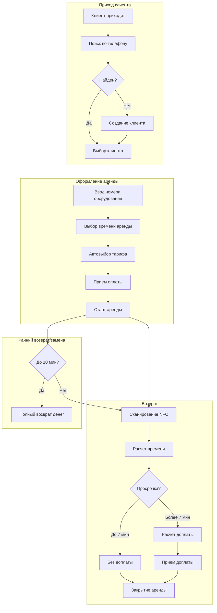

# Функциональные требования для системы BikeRent

## Анализ исходных данных

На основе [docs/problem-statement-and-goal.md](docs/problem-statement-and-goal.md)
и [docs/main-flow.md](docs/main-flow.md) выделены:

**Роли пользователей:**

- Оператор проката (основной пользователь)
- Клиент
- Администратор
- Бухгалтерия
- Технический персонал

**Ключевые бизнес-правила из main-flow:**

- Поиск клиента по 4 последним цифрам телефона
- Добавление оборудования по порядковому номеру
- Тарификация: 1 час, 2 часа, сутки
- Тариф зависит от типа оборудования и выбирается автоматически при выборе оборудования и времени аренды
- Расчет с кратностью 5 минут
- Правило "прощения": до 7 минут просрочки не тарифицируется
- Просрочка > 7 минут = 10 минут доплаты
- Возврат/замена в течение 10 минут = полный возврат денег
- Считывание NFC-меток при возврате

## Структура документа функциональных требований

Документ будет создан в файле `docs/functional-requirements.md` со следующими разделами:

### 1. Управление клиентами (FR-CL-xxx)

- Поиск клиента по частичному совпадению номера телефона
- Быстрое создание клиента (только номер телефона)
- Полное создание/редактирование профиля клиента
- История аренд клиента

### 2. Управление оборудованием (FR-EQ-xxx)

- Справочник оборудования (велосипеды, самокаты и т.д.)
- Порядковые номера и NFC-метки
- Статусы оборудования (доступно, в аренде, на обслуживании)
- Учет износа и состояния

### 3. Процесс аренды (FR-RN-xxx)

- Создание записи аренды
- Привязка оборудования по порядковому номеру
- Установка времени начала и расчетного времени
- Внесение предоплаты
- Возврат оборудования через NFC-сканирование
- Автоматический расчет стоимости

### 4. Тарификация и расчеты (FR-TR-xxx)

- Тарифные планы (почасовая, суточная аренда)
- Автоматический подбор тарифа на основе типа оборудования и времени аренды
- Расчет с кратностью 5 минут
- Правило "прощения" 7 минут
- Расчет доплаты за просрочку
- Возврат средств при замене/отмене до 10 минут

### 5. Финансовые операции (FR-FN-xxx)

- Прием оплаты
- Возврат средств
- Расчет доплаты
- Финансовая история по клиенту и аренде

### 6. Отчетность и аналитика (FR-RP-xxx)

- Отчет по доходам за период
- Отчет по загрузке оборудования
- Финансовая сверка для бухгалтерии
- Аналитика по клиентам

### 7. Техническое обслуживание (FR-MT-xxx)

- Планирование ТО на основе пробега/часов использования
- Учет ремонтов и замен
- Вывод оборудования из эксплуатации

### 8. Администрирование (FR-AD-xxx)

- Управление пользователями и ролями
- Настройка тарифов
- Настройка бизнес-правил (пороги прощения, кратность и т.д.)



## Формат каждого требования

```
**FR-XX-NNN**: [Название]

**Описание**: Система должна...

**Роль**: [Оператор/Клиент/Администратор/Бухгалтерия/Технический персонал]

**Приоритет**: [Высокий/Средний/Низкий]

**Бизнес-правило**: (если применимо)
```