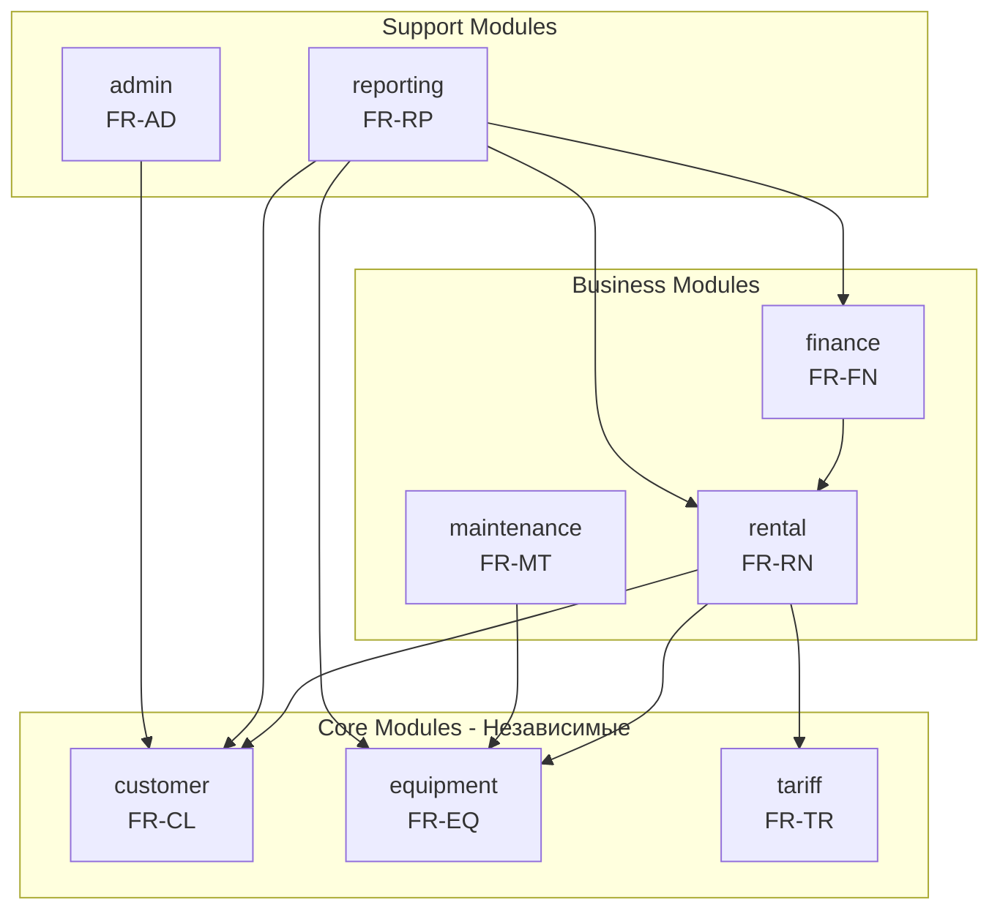
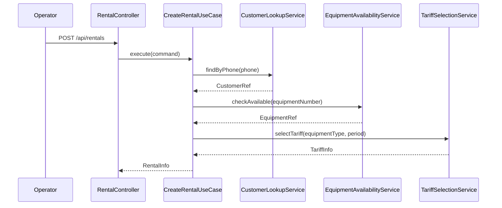
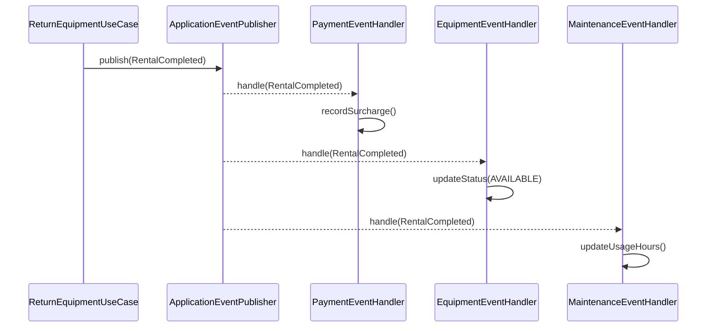
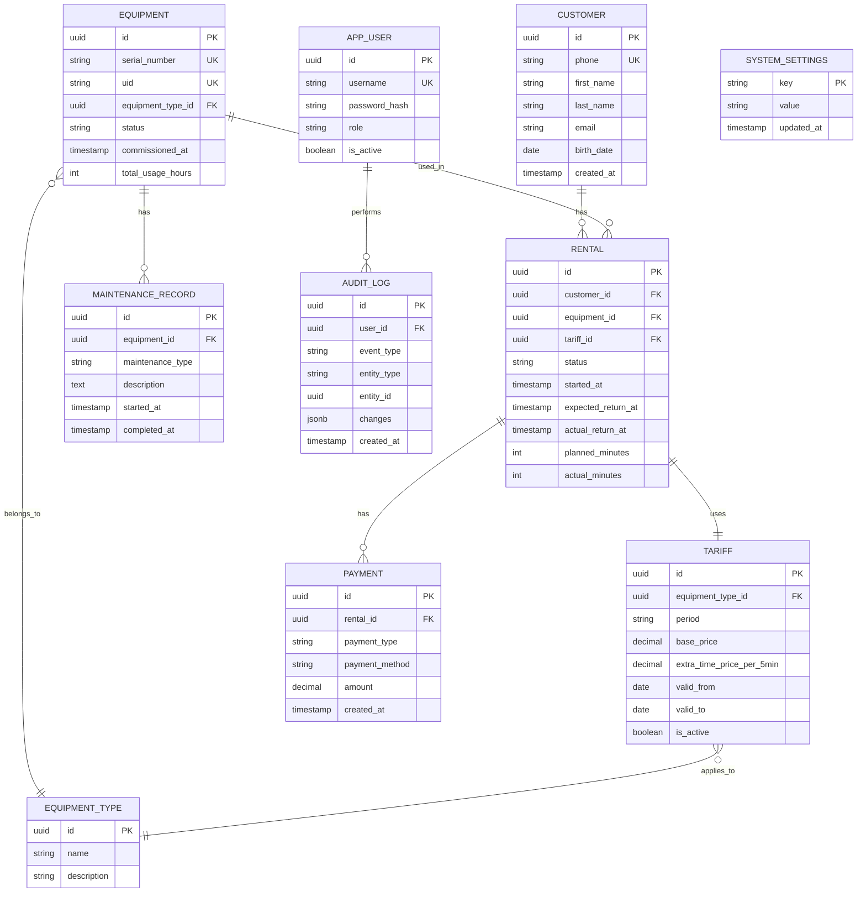
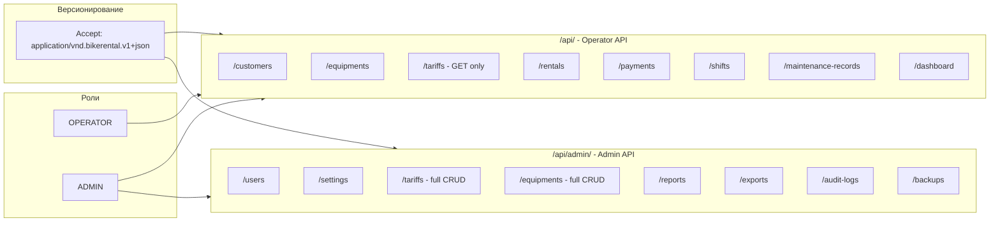

# Архитектура системы BikeRent

## 1. Цель сервиса

Создание цифровой системы управления прокатом оборудования (велосипеды, самокаты), автоматизирующей учет аренды,
клиентов,
финансовых операций и технического обслуживания для повышения операционной эффективности и качества обслуживания
клиентов.

---

## 2. Архитектурного подход

### Spring Modulith (пакетная модульность)

**Обоснование:**

- NFR-100 требует монолитной архитектуры с модульностью
- NFR-110 требует деплоя одним файлом (fat JAR)
- NFR-112 требует минимальной инфраструктуры
- Spring Modulith уже интегрирован в проект ([`service/build.gradle`](service/build.gradle))

**Преимущества:**

- Строгий контроль границ модулей через `@ApplicationModule`
- Автоматическая документация модульной структуры
- Event-driven коммуникация между модулями
- Простой рефакторинг в микросервисы при необходимости

---

## 3. Доменная декомпозиция

На основе функциональных требований (FR-*) выделяются 8 модулей:



Каждый модуль в Spring Modulith следует многоуровневой архитектуре с четкими границами:

```
┌────────────────────────────────────────────────────────────────┐
│              web (REST API)                                    │  ← Входная точка (HTTP)
├────────────────────────────────────────────────────────────────┤
│         application (Use Cases)                                │  ← Бизнес-сценарии
├────────────────────────────────────────────────────────────────┤
│      domain (Domain repository interface & Business Logic)     │  ← Бизнес-логика
├────────────────────────────────────────────────────────────────┤
│      infrastructure (Persistant, adapter)                      │  ← Инфраструктура (БД, MessageBroker, Cache )
├────────────────────────────────────────────────────────────────┤
│        event (Public DTO events)                               │  ← Интерфейс для других модулей
└────────────────────────────────────────────────────────────────┘
```

### 3.1 Модуль Customer (FR-CL-001 - FR-CL-005)

**Ответственность:** Управление профилями клиентов

**Ключевые сущности:**

- `Customer` - профиль клиента (телефон, имя, email, дата рождения)
- `CustomerStatistics` - агрегированная статистика

**API для других модулей:**

- `CustomerRef` - ссылка на клиента (id + контактные данные)
- `CustomerLookupService` - поиск по телефону

### 3.2 Модуль Equipment (FR-EQ-001 - FR-EQ-005)

**Ответственность:** Каталог оборудования и управление статусами

**Ключевые сущности:**

- `Equipment` - единица оборудования (порядковый номер, QR/NFC UID, тип, статус)
- `EquipmentType` - тип оборудования (велосипед, самокат)
- `EquipmentStatus` - enum: AVAILABLE, RENTED, MAINTENANCE, DECOMMISSIONED

**API для других модулей:**

- `EquipmentRef` - ссылка на оборудование
- `EquipmentAvailabilityService` - проверка доступности
- События: `EquipmentStatusChanged`

### 3.3 Модуль Tariff (FR-TR-001 - FR-TR-005)

**Ответственность:** Справочник тарифов и расчет стоимости

**Ключевые сущности:**

- `Tariff` - тариф (тип оборудования, период, базовая цена, цена доп.времени)
- `TariffPeriod` - enum: HOUR_1, HOUR_2, DAY

**Ключевые сервисы:**

- `TariffSelectionService` - автоматический подбор тарифа
- `RentalCostCalculator` - расчет стоимости с учетом бизнес-правил:
    - Кратность 5 минут
    - Правило "прощения" (до 7 мин)
    - Округление просрочки до 10 мин

### 3.4 Модуль Rental (FR-RN-001 - FR-RN-009) - CORE

**Ответственность:** Основной бизнес-процесс аренды

**Ключевые сущности:**

- `Rental` - запись аренды (клиент, оборудование, время начала/окончания, статус)
- `RentalStatus` - enum: DRAFT, ACTIVE, COMPLETED, CANCELLED

**Ключевые use cases:**

- `CreateRentalUseCase` - создание аренды (FR-RN-001)
- `StartRentalUseCase` - запуск аренды с предоплатой (FR-RN-005)
- `ReturnEquipmentUseCase` - возврат с расчетом доплаты (FR-RN-006)
- `CancelRentalUseCase` - отмена в течение 10 мин (FR-RN-008)

**События:**

- `RentalStarted` - уведомляет Finance о предоплате
- `RentalCompleted` - уведомляет Finance о доплате
- `RentalCancelled` - уведомляет Finance о возврате

### 3.5 Модуль Finance (FR-FN-001 - FR-FN-004)

**Ответственность:** Финансовые операции и касса

**Ключевые сущности:**

- `Payment` - платеж (тип, сумма, способ оплаты, связь с арендой)
- `PaymentType` - enum: PREPAYMENT, SURCHARGE, REFUND
- `PaymentMethod` - enum: CASH, CARD, QR
- `CashRegister` - касса оператора (смена, баланс)

**Подписка на события:**

- `RentalStarted` -> создание записи предоплаты
- `RentalCompleted` -> фиксация доплаты
- `RentalCancelled` -> создание возврата

### 3.6 Модуль Reporting (FR-RP-001 - FR-RP-005)

**Ответственность:** Отчетность и аналитика

**Ключевые отчеты:**

- `IncomeReport` - доходы за период
- `EquipmentUtilizationReport` - загрузка оборудования
- `CustomerAnalyticsReport` - аналитика по клиентам

**Особенности:**

- Read-only доступ к данным других модулей
- Асинхронная агрегация через события

### 3.7 Модуль Maintenance (FR-MT-001 - FR-MT-004)

**Ответственность:** Техническое обслуживание

**Ключевые сущности:**

- `MaintenanceRecord` - запись ТО (оборудование, тип работ, дата)
- `MaintenanceSchedule` - график планового ТО

**Подписка на события:**

- `RentalCompleted` -> обновление счетчика использования

### 3.8 Модуль Admin (FR-AD-001 - FR-AD-006)

**Ответственность:** Управление пользователями и настройками

**Ключевые сущности:**

- `User` - пользователь системы
- `Role` - enum: OPERATOR, ADMIN (упрощенная модель: оператор = все кроме админа)
- `SystemSettings` - настраиваемые бизнес-параметры
- `AuditLog` - журнал аудита

**Ролевая модель:**

- **OPERATOR** - объединяет функции оператора проката, технического персонала и бухгалтерии
- **ADMIN** - полный доступ ко всем функциям + управление системой

---

## 4. Структура пакетов

```
com.github.jenkaby.bikerental
├── BikeRentalApplication.java
├── shared/                          # Shared Kernel
│   ├── package-info.java            # @ApplicationModule(type = ApplicationModule.Type.OPEN)
│   ├── exception/                   # Common exceptions
│   ├── domain/
│   │   ├── Money.java              # Value Object для денежных сумм
│   │   └── TimeRange.java          # Value Object для временных интервалов
│   └── event/
│   │   └── DomainEvent.java        # Базовый интерфейс событий
│   └── web/
│       └── advice/
│           └── CoreExceptionHandlerAdvice.java  # Глобальный обработчик исключений
├── rental/
│    │
│    ├── package-info.java                       # @ApplicationModule + @NamedInterfaces
│    ├── RentalFacade.java                       # PUBLIC - Facade для других модулей
│    ├── RentalInfo.java                         # PUBLIC - DTO для других модулей
│    ├── event/                                  # PUBLIC (через @NamedInterface)
│    │   ├── RentalStarted.java
│    │   ├── RentalCompleted.java
│    │   └── RentalCancelled.java
│    ├── domain/
│    │   ├── model/
│    │   │   ├── Rental.java                 # Aggregate Root (чистый POJO)
│    │   │   ├── RentalStatus.java           # Enum
│    │   │   └── vo/                         # Value Objects
│    │   │       ├── RentTime.java
│    │   │       ├── PayAmount.java
│    │   │       ├── RentalId.java
│    │   │       └── CustomerId.java
│    │   └── repository/
│    │       └── RentalRepository.java       # Domain repository interface
│    ├── application/
│    │   ├── usecase/                        # UseCase интерфейсы
│    │   │   ├── CreateRentalUseCase.java
│    │   │   ├── StartRentalUseCase.java
│    │   │   ├── ReturnEquipmentUseCase.java
│    │   │   ├── CancelRentalUseCase.java
│    │   │   └── RentalQueryUseCase.java
│    │   ├── service/                        # Реализации UseCase
│    │   │   ├── CreateRentalService.java
│    │   │   ├── StartRentalService.java
│    │   │   ├── ReturnEquipmentService.java
│    │   │   ├── CancelRentalService.java
│    │   │   └── RentalQueryService.java
│    │   ├── port/                           # Ports (абстракции)
│    │   │   ├── DomainEventPublisher.java
│    │   │   └── ClockService.java
│    │   └── mapper/
│    │       └── RentalMapper.java           # MapStruct: domain ↔ Public DTO
│    ├── infrastructure/
│    │   ├── persistence/
│    │   │   ├── entity/
│    │   │   │   └── RentalJpaEntity.java
│    │   │   ├── repository/
│    │   │   │   └── RentalJpaRepository.java
│    │   │   ├── adapter/
│    │   │   │   └── RentalRepositoryAdapter.java
│    │   │   └── mapper/
│    │   │       └── RentalJpaMapper.java    # MapStruct: domain ↔ JPA
│    │   ├── event/
│    │   │   └── SpringDomainEventPublisher.java
│    │   └── time/
│    │       └── SystemClockService.java
│    └── web/
│         ├── command/                        # Command контроллеры
│         │   ├── RentalCommandController.java
│         │   ├── dto/
│         │   │   ├── CreateRentalRequest.java
│         │   │   ├── StartRentalRequest.java
│         │   │   ├── ReturnEquipmentRequest.java
│         │   │   └── CancelRentalRequest.java
│         │   └── mapper/
│         │       └── RentalCommandMapper.java  # MapStruct: Web DTO ↔ UseCase Command
│         └── query/                            # Query контроллеры
│             ├── RentalQueryController.java
│             ├── dto/
│             │   └── RentalResponse.java
│             └── mapper/
│                 └── RentalQueryMapper.java    # MapStruct: RentalInfo ↔ Web Response
├── customer/
│     └─ # ometted for brevity, similar structure to other modules
├── equipment/
│     └─ # ometted for brevity, similar structure to other modules
├── tariff/
│     └─ # ometted for brevity, similar structure to other modules
├── finance/
│     └─ # ometted for brevity, similar structure to other modules
├── reporting/
│     └─ # ometted for brevity, similar structure to other modules
├── maintenance/
│     └─ # ometted for brevity, similar structure to other modules
└── admin/
│     └─ # ometted for brevity, similar structure to other modules
```

---

## 5. Коммуникация между модулями

### 5.1 Синхронная (через API интерфейсы)



### 5.2 Асинхронная (через Spring Application Events)



---

## 6. Модель данных (ER-диаграмма)



---

## 7. REST API структура

API разделен на два контекста по ролям: **Operator API** (роль OPERATOR) и **Admin API** (роль ADMIN).

### 7.1 RESTful принципы

- Используются **существительные во множественном числе** для ресурсов
- **HTTP методы** определяют действие: GET (чтение), POST (создание), PUT (полное обновление), PATCH (частичное
  обновление), DELETE (удаление)
- **Фильтрация** через query parameters: `?status=active&from=2026-01-01`
- **Изменение состояния** через PATCH с телом запроса: `{"status": "ACTIVE"}`
- **Вложенные ресурсы** для связанных данных: `/customers/{id}/rentals`
- **Версионирование** через Content-Type (media type negotiation)

---

### 7.2 Версионирование API (Content-Type Negotiation)

Версия API указывается через заголовки `Accept` и `Content-Type` с использованием vendor-specific media type:

```
application/vnd.bikerental.v1+json
```

**Формат:** `application/vnd.{vendor}.{version}+json`

**Конфигурация Spring Boot:**

```java

@Configuration
public class ApiVersioningConfig implements WebMvcConfigurer {

  public static final String V1_MEDIA_TYPE = "application/vnd.bikerental.v1+json";

    @Override
    public void configureContentNegotiation(ContentNegotiationConfigurer configurer) {
        configurer
                .defaultContentType(MediaType.parseMediaType(V1_MEDIA_TYPE))
                .mediaType("v1", MediaType.parseMediaType(V1_MEDIA_TYPE));
    }
}

// Использование в контроллере
@RestController
@RequestMapping("/api/customers")
public class CustomerController {

  @GetMapping(produces = "application/vnd.bikerental.v1+json")
    public List<CustomerDto> getCustomers(@RequestParam(required = false) String phone) {
        // ...
    }
}
```
**Fallback:**

- Если `Accept` header не указан, используется последняя стабильная версия (v1)

---

### 7.3 Operator API (`/api/...`)

Доступен для роли **OPERATOR** (и ADMIN). Основные рабочие операции.

**Клиенты (customer module):**

| Метод | Endpoint                  | Описание                                        |
|-------|---------------------------|-------------------------------------------------|
| GET   | `/customers`              | Список клиентов с фильтрацией `?phone={digits}` |
| POST  | `/customers`              | Создание клиента                                |
| GET   | `/customers/{id}`         | Профиль клиента                                 |
| PUT   | `/customers/{id}`         | Полное обновление профиля                       |
| PATCH | `/customers/{id}`         | Частичное обновление профиля                    |
| GET   | `/customers/{id}/rentals` | История аренд клиента                           |

**Оборудование (equipment module):**

| Метод | Endpoint                               | Описание                                                                         |
|-------|----------------------------------------|----------------------------------------------------------------------------------|
| GET   | `/equipment-types`                     | Список типов оборудования (bicycle, scooter, etc.)                               |
| GET   | `/equipment-statuses`                  | Список статусов оборудования (available, rented, etc.)                           |
| GET   | `/equipments`                          | Список оборудования с фильтрацией `?status={slug}&type={slug}&page={n}&size={n}` |
| POST  | `/equipments`                          | Создание нового оборудования                                                     |
| GET   | `/equipments/{id}`                     | Детали оборудования по ID                                                        |
| PUT   | `/equipments/{id}`                     | Полное обновление оборудования                                                   |
| GET   | `/equipments/by-uid/{uid}`             | Поиск оборудования по UID (QR/NFC код)                                           |
| GET   | `/equipments/by-serial/{serialNumber}` | Поиск оборудования по порядковому номеру                                         |

**Тарифы (tariff module):**

| Метод | Endpoint | Описание |
|-------|----------|----------|
| GET | `/tariffs` | Справочник активных тарифов |
| GET | `/tariffs/{id}` | Детали тарифа |
| GET | `/tariffs/cost` | Расчет стоимости `?equipment_type_id={id}&duration_minutes={min}` |

**Аренда (rental module):**

| Метод | Endpoint | Описание |
|-------|----------|----------|
| GET | `/rentals` | Список аренд с фильтрацией `?status=ACTIVE&overdue=true` |
| POST | `/rentals` | Создание аренды (статус DRAFT) |
| GET | `/rentals/{id}` | Детали аренды |
| PATCH | `/rentals/{id}` | Изменение статуса аренды |
| GET | `/rentals/{id}/payments` | Платежи по аренде |


**Платежи (finance module):**

| Метод | Endpoint | Описание |
|-------|----------|----------|
| GET | `/payments` | Список платежей с фильтрацией `?rental_id={id}&date_from={date}` |
| POST | `/payments` | Регистрация платежа |
| GET | `/payments/{id}` | Детали платежа |

**Смены/Касса (finance module):**

| Метод | Endpoint | Описание |
|-------|----------|----------|
| GET | `/shifts` | Список смен `?status=OPEN&operator_id={id}` |
| POST | `/shifts` | Открытие новой смены |
| GET | `/shifts/current` | Текущая открытая смена |
| GET | `/shifts/{id}` | Детали смены |
| PATCH | `/shifts/{id}` | Закрытие смены `{"status": "CLOSED", "actual_cash": 15000}` |

**Техническое обслуживание (maintenance module):**

| Метод | Endpoint | Описание |
|-------|----------|----------|
| GET | `/maintenance-records` | Записи ТО `?equipment_id={id}&status=PENDING` |
| POST | `/maintenance-records` | Создание записи ТО |
| GET | `/maintenance-records/{id}` | Детали записи ТО |
| PATCH | `/maintenance-records/{id}` | Обновление записи `{"status": "COMPLETED"}` |

**Дашборд и отчеты (reporting module):**

| Метод | Endpoint | Описание |
|-------|----------|----------|
| GET | `/dashboard` | Сводка текущего дня |
| GET | `/reports/shift` | Отчет по смене `?shift_id={id}` |

---

### 7.4 Admin API (`/api/admin/...`)

Доступен только для роли **ADMIN**. Настройки и управление системой.

**Пользователи (admin module):**

| Метод | Endpoint | Описание |
|-------|----------|----------|
| GET | `/admin/users` | Список пользователей |
| POST | `/admin/users` | Создание пользователя |
| GET | `/admin/users/{id}` | Данные пользователя |
| PUT | `/admin/users/{id}` | Полное обновление |
| PATCH | `/admin/users/{id}` | Частичное обновление `{"is_active": false}` |
| PUT | `/admin/users/{id}/password` | Установка нового пароля |

**Настройки системы (admin module):**

| Метод | Endpoint | Описание |
|-------|----------|----------|
| GET | `/admin/settings` | Все настройки |
| GET | `/admin/settings/{key}` | Конкретная настройка |
| PUT | `/admin/settings/{key}` | Обновление настройки |
| PATCH | `/admin/settings` | Массовое обновление настроек |

**Тарифы - полный CRUD (tariff module):**

| Метод | Endpoint | Описание |
|-------|----------|----------|
| GET | `/admin/tariffs` | Все тарифы (включая неактивные) |
| POST | `/admin/tariffs` | Создание тарифа |
| GET | `/admin/tariffs/{id}` | Детали тарифа |
| PUT | `/admin/tariffs/{id}` | Полное обновление тарифа |
| PATCH | `/admin/tariffs/{id}` | Частичное обновление `{"is_active": false}` |
| DELETE | `/admin/tariffs/{id}` | Удаление (если не используется) |

**Типы оборудования (equipment module):**

| Метод | Endpoint                        | Описание                       |
|-------|---------------------------------|--------------------------------|
| GET   | `/admin/equipment-types`        | Список всех типов оборудования |
| POST  | `/admin/equipment-types`        | Создание нового типа           |
| PUT   | `/admin/equipment-types/{slug}` | Обновление типа по slug        |

**Статусы оборудования (equipment module):**

| Метод | Endpoint                           | Описание                   |
|-------|------------------------------------|----------------------------|
| GET   | `/admin/equipment-statuses`        | Список всех статусов       |
| POST  | `/admin/equipment-statuses`        | Создание нового статуса    |
| PUT   | `/admin/equipment-statuses/{slug}` | Обновление статуса по slug |

**Оборудование - полный CRUD (equipment module):**

| Метод | Endpoint                                     | Описание                                               |
|-------|----------------------------------------------|--------------------------------------------------------|
| GET   | `/admin/equipments`                          | Все оборудование (включая списанное) с фильтрацией     |
| POST  | `/admin/equipments`                          | Добавление нового оборудования                         |
| GET   | `/admin/equipments/{id}`                     | Детали оборудования по ID                              |
| PUT   | `/admin/equipments/{id}`                     | Полное обновление оборудования                         |
| GET   | `/admin/equipments/by-uid/{uid}`             | Поиск по UID (для административных целей)              |
| GET   | `/admin/equipments/by-serial/{serialNumber}` | Поиск по серийному номеру (для административных целей) |

**Отчетность и аналитика (reporting module):**

| Метод | Endpoint | Описание |
|-------|----------|----------|
| GET | `/admin/reports/income` | Доходы `?from={date}&to={date}&group_by=day` |
| GET | `/admin/reports/equipment-utilization` | Загрузка `?from={date}&to={date}` |
| GET | `/admin/reports/customer-analytics` | Аналитика клиентов |
| GET | `/admin/reports/financial-reconciliation` | Финансовая сверка |

**Экспорт (reporting module):**

| Метод | Endpoint | Описание |
|-------|----------|----------|
| GET | `/admin/exports/income` | Экспорт доходов `?format=xlsx&from={date}&to={date}` |
| GET | `/admin/exports/audit-log` | Экспорт аудита `?format=pdf` |

**Журнал аудита (admin module):**

| Метод | Endpoint | Описание |
|-------|----------|----------|
| GET | `/admin/audit-logs` | Журнал аудита `?user_id={id}&event_type={type}&from={date}` |
| GET | `/admin/audit-logs/{id}` | Детали записи |

**Резервные копии (admin module):**

| Метод | Endpoint | Описание |
|-------|----------|----------|
| GET | `/admin/backups` | Список резервных копий |
| POST | `/admin/backups` | Создание резервной копии |
| GET | `/admin/backups/{id}` | Метаданные копии |
| POST | `/admin/backups/{id}/restorations` | Запуск восстановления (создает ресурс restoration) |
| GET | `/admin/restorations/{id}` | Статус восстановления |

---

### 7.5 Диаграмма API по ролям


---

## 8. Технические решения

### 8.1 Аутентификация и авторизация (NFR-020)

**Аутентификация:**

- Spring Security OAuth2 с Google Sign-In
- JWT токены для API авторизации

**Авторизация по ролям:**

```java

@Configuration
@EnableMethodSecurity
public class SecurityConfig {

    @Bean
    public SecurityFilterChain filterChain(HttpSecurity http) {
        return http
                .authorizeHttpRequests(auth -> auth
                        // Admin API - только ADMIN
                        .requestMatchers("/api/admin/**")
                        .hasRole("ADMIN")
                        // Operator API - доступен OPERATOR и ADMIN
                        .requestMatchers("/api/**")
                        .hasAnyRole("OPERATOR", "ADMIN")
                        .anyRequest().authenticated()
                )
                .oauth2Login(...)
            .build();
    }
}
```

**Упрощенная ролевая модель:**

- `OPERATOR` - выполняет все операционные задачи (аренда, клиенты, оплата, ТО, базовые отчеты)
- `ADMIN` - полный доступ + управление пользователями, настройками, тарифами, полная аналитика

### 8.2 NFC/QR сканирование (FR-EQ-003)

- Поиск оборудования по UID: `GET /api/equipments/by-uid/{uid}`
- Поиск оборудования по серийному номеру: `GET /api/equipments/by-serial/{serialNumber}`
- Поиск активной аренды: `GET /api/rentals?status=ACTIVE&equipment_id={id}` (после получения equipment)
- Frontend использует Web NFC API (Android Chrome) или камеру для QR
- Дедуплицированные endpoints для точного поиска (не query params)

### 8.3 Экспорт отчетов (NFR-014)

- Apache POI для Excel
- iText/OpenPDF для PDF

### 8.4 Деплой (NFR-110, NFR-111)

- GitHub Actions CI/CD (`.github/workflows/build.yml`)
- Single fat JAR через `./gradlew bootJar`
- Docker-compose для локальной разработки (`docker/`)

---

## 9. Приоритеты реализации

**Phase 1 - MVP (Высокий приоритет):**

1. customer module - базовый CRUD + поиск по телефону
2. equipment module - каталог + статусы
3. tariff module - справочник + расчет стоимости
4. rental module - полный цикл аренды

**Phase 2 - Финансы и отчетность:**

5. finance module - платежи и касса
6. reporting module - базовые отчеты
7. admin module - пользователи и настройки

**Phase 3 - Расширение:**

8. maintenance module - ТО и обслуживание
9. Интеграция NFC/QR сканирования
10. Google OAuth

---

## 10. Валидация архитектуры

Spring Modulith предоставляет встроенные тесты для проверки модульной структуры:

```java

@Test
void verifyModularStructure() {
    ApplicationModules.of(BikeRentalApplication.class).verify();
}

@Test
void generateModuleDocumentation() {
    new Documenter(ApplicationModules.of(BikeRentalApplication.class))
            .writeDocumentation();
}
```
