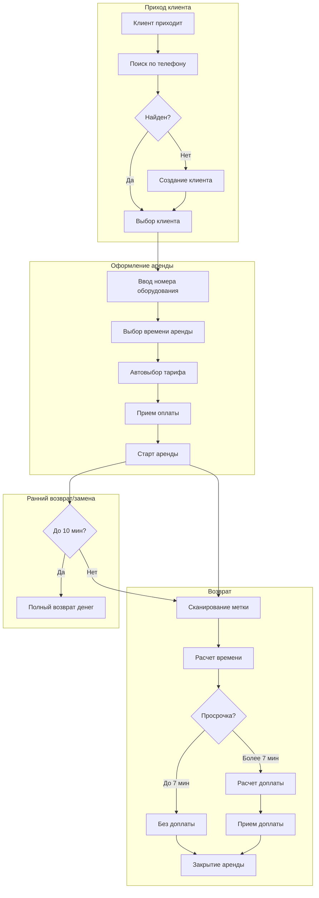

# Функциональные требования системы BikeRental

**Версия документа:** 1.2  
**Дата:** 21.01.2026  
**Статус:** Draft

---

## 1. Введение

### 1.1 Назначение документа

Данный документ описывает функциональные требования к системе управления прокатом оборудования BikeRental. Требования
охватывают все роли пользователей и основные бизнес-процессы.

### 1.2 Область применения

Система предназначена для автоматизации процессов учета аренды, управления клиентами, оборудованием, финансовыми
операциями и отчетностью в сервисе проката велосипедов, самокатов и аналогичного оборудования.

### 1.3 Роли пользователей

- **Оператор проката** — сотрудник, оформляющий аренду и возврат оборудования
- **Клиент** — пользователь, арендующий оборудование
- **Администратор** — сотрудник, управляющий настройками системы и пользователями
- **Бухгалтерия** — сотрудники, работающие с финансовой отчетностью
- **Технический персонал** — сотрудники, обслуживающие оборудование

### 1.4 Ключевые бизнес-правила

1. Поиск клиента по 4 последним цифрам телефона
2. Добавление оборудования по порядковому номеру
3. Тарификация: 1 час, 2 часа, сутки
4. Тариф зависит от типа оборудования и выбирается автоматически
5. Расчет с кратностью 5 минут
6. Правило "прощения": до 7 минут просрочки не тарифицируется
7. Просрочка > 7 минут = округление до 10 минут и начисление доплаты
8. Возврат/замена в течение 10 минут = полный возврат денег
9. Считывание NFC-меток при возврате

---

## 2. Функциональные требования

### 2.1 Управление клиентами (FR-CL)

#### FR-CL-001: Поиск клиента по номеру телефона

**Описание:** Система должна предоставлять возможность поиска клиента по частичному совпадению номера телефона.

**Роль:** Оператор проката

**Приоритет:** Высокий

**Бизнес-правило:**

- Поиск выполняется по минимум 4 последним цифрам номера телефона
- Система должна отображать список всех совпадений
- Поиск должен работать в режиме реального времени (при вводе)

**Критерии приемки:**

- Ввод 4 цифр возвращает всех клиентов с совпадением
- Поддержка поиска от 4 до 11 цифр
- Время отклика < 1 секунды

---

#### FR-CL-002: Быстрое создание клиента

**Описание:** Система должна позволять быстро создать профиль клиента с минимальными данными (только номер телефона).

**Роль:** Оператор проката

**Приоритет:** Высокий

**Критерии приемки:**

- Возможность создания клиента только с номером телефона
- Валидация формата номера телефона
- Автоматическое присвоение уникального ID клиента
- Время создания < 2 секунд

---

#### FR-CL-003: Полное создание/редактирование профиля клиента

**Описание:** Система должна предоставлять возможность ввода и редактирования полной информации о клиенте.

**Роль:** Оператор проката

**Приоритет:** Высокий

**Поля профиля:**

- Номер телефона (обязательное)
- Имя
- Фамилия
- Email
- Дата рождения
- Комментарии
- Дата регистрации (автоматически)

**Критерии приемки:**

- Все поля доступны для редактирования кроме даты регистрации
- Валидация email и телефона
- Сохранение истории изменений

---

#### FR-CL-004: История аренд клиента

**Описание:** Система должна отображать историю всех аренд клиента.

**Роль:** Оператор проката, Бухгалтерия

**Приоритет:** Низкий

**Критерии приемки:**

- Список всех аренд с датами начала и окончания
- Информация об арендованном оборудовании
- Сумма оплаты и доплат
- Статус аренды (активная, завершена, отменена)
- Возможность фильтрации по периоду

---

#### FR-CL-005: Статистика по клиенту

**Описание:** Система должна показывать статистику использования услуг клиентом.

**Роль:** Оператор проката, Администратор

**Приоритет:** Низкий

**Показатели:**

- Общее количество аренд
- Общая сумма оплат
- Средняя длительность аренды
- Дата последней аренды
- Статус лояльности (новый/постоянный)

---

### 2.2 Управление оборудованием (FR-EQ)

#### FR-EQ-001: Справочник оборудования

**Описание:** Система должна поддерживать справочник всего прокатного оборудования.

**Роль:** Администратор

**Приоритет:** Высокий

**Атрибуты оборудования:**

- Уникальный ID
- Порядковый номер (для визуального поиска)
- QR-код (UID)
- Тип оборудования (велосипед, самокат, другое)
- Модель/название
- Статус (доступно, в аренде, на обслуживании, списано)
- Дата ввода в эксплуатацию
- Техническое состояние

**Критерии приемки:**

- Возможность добавления нового оборудования
- Редактирование данных оборудования
- Поиск по порядковому номеру и QR-коду
- Фильтрация по типу и статусу

---

#### FR-EQ-002: Добавление оборудования по порядковому номеру

**Описание:** Система должна позволять добавить оборудование в аренду по его порядковому номеру.

**Роль:** Администратор

**Приоритет:** Высокий

**Бизнес-правило:**

- Ввод порядкового номера проще, чем сканирование QR-кода каждого велосипеда
- Система должна проверять доступность оборудования
- Поддержка автодополнения при вводе

**Критерии приемки:**

- Возможность ввода порядкового номера
- Проверка статуса "доступно"
- Отображение информации об оборудовании после выбора
- Время отклика < 1 секунды

---

#### FR-EQ-003: Сканирование QR-кода при возврате

**Описание:** Система должна поддерживать считывание NFC-меток оборудования через мобильное устройство при возврате.

**Роль:** Оператор проката

**Приоритет:** Высокий

**Бизнес-правило:**

- При возврате оборудование сканируется телефоном с NFC
- Автоматическое определение оборудования по UID метки
- Пометка оборудования как возвращенного

**Критерии приемки:**

- Поддержка камеры мобильного устройства
- Автоматическое сопоставление UID с оборудованием
- Обработка ошибок (метка не найдена, оборудование не в аренде)

---

#### FR-EQ-004: Статусы оборудования

**Описание:** Система должна управлять статусами оборудования и автоматически менять их.

**Роль:** Система (автоматически), Оператор проката, Администратор

**Приоритет:** Высокий

**Статусы:**

- **Доступно** — готово к аренде
- **В аренде** — находится у клиента
- **На обслуживании** — на ремонте/ТО
- **Списано** — выведено из эксплуатации

**Переходы статусов:**

- Доступно → В аренде (при оформлении аренды)
- В аренде → Доступно (при возврате)
- Доступно → На обслуживании (ручное переключение)
- На обслуживании → Доступно (после завершения ТО)
- Любой статус → Списано (при списании)

---

#### FR-EQ-005: Учет износа и пробега

**Описание:** Система должна автоматически учитывать время использования и пробег оборудования.

**Роль:** Система (автоматически), Технический персонал

**Приоритет:** Низкий

**Показатели:**

- Общее время в аренде (часы)
- Количество аренд
- Дата последнего ТО
- Следующее плановое ТО (по времени использования)

**Критерии приемки:**

- Автоматический подсчет времени использования
- Отображение в карточке оборудования
- Уведомления о необходимости ТО

---

### 2.3 Процесс аренды (FR-RN)

#### FR-RN-001: Создание записи аренды

**Описание:** Система должна позволять оператору создать новую запись аренды.

**Роль:** Оператор проката

**Приоритет:** Высокий

**Последовательность действий:**

1. Поиск/создание клиента
2. Выбор оборудования по порядковому номеру
3. Выбор времени аренды (1 час, 2 часа, сутки и т.д.)
4. Автоматический подбор тарифа
5. Расчет предварительной стоимости
6. Внесение предоплаты
7. Запуск аренды

**Критерии приемки:**

- Все шаги выполняются последовательно
- Невозможно пропустить обязательные шаги
- Сохранение черновика аренды

---

#### FR-RN-002: Автоматический подбор тарифа

**Описание:** Система должна автоматически подбирать тариф на основе типа оборудования и выбранного времени аренды.

**Роль:** Система (автоматически)

**Приоритет:** Высокий

**Бизнес-правило:**

- Тариф зависит от типа оборудования (велосипед/самокат/другое)
- Время аренды: 1 час, 2 часа, сутки, и т.д.
- Система автоматически выбирает соответствующий тариф из справочника

**Критерии приемки:**

- После выбора оборудования и времени система показывает тариф
- Отображение стоимости за выбранный период
- Возможность ручного изменения тарифа (для администратора)

---

#### FR-RN-003: Установка даты и времени начала проката

**Описание:** Система должна фиксировать точное время начала аренды.

**Роль:** Оператор проката, Система (автоматически)

**Приоритет:** Высокий

**Бизнес-правило:**

- По умолчанию время начала = текущее время
- Возможность ручного изменения (например, если клиент оформлял аренду заранее)

**Критерии приемки:**

- Фиксация времени с точностью до секунды
- Автоматическое заполнение текущим временем
- Возможность редактирования

---

#### FR-RN-004: Внесение предоплаты

**Описание:** Система должна позволять внести предоплату за аренду.

**Роль:** Оператор проката

**Приоритет:** Высокий

**Критерии приемки:**

- Указание суммы предоплаты
- Фиксация способа оплаты (наличные, карта)
- Формирование чека/квитанции
- Сохранение в финансовой истории

---

#### FR-RN-005: Запуск аренды

**Описание:** Система должна активировать аренду после внесения предоплаты.

**Роль:** Оператор проката

**Приоритет:** Высокий

**Действия системы:**

- Изменение статуса аренды на "Активна"
- Изменение статуса оборудования на "В аренде"
- Фиксация времени начала
- Расчет ожидаемого времени возврата

**Критерии приемки:**

- Невозможность удалить активную аренду
- Отображение активной аренды в списке текущих
- Оборудование недоступно для новых аренд

---

#### FR-RN-006: Возврат оборудования

**Описание:** Система должна обрабатывать процесс возврата оборудования клиентом.

**Роль:** Оператор проката

**Приоритет:** Высокий

**Последовательность действий:**

1. Сканирование NFC-метки оборудования
2. Автоматическое определение аренды
3. Фиксация времени возврата
4. Расчет фактического времени аренды
5. Расчет итоговой стоимости
6. Расчет доплаты (если есть)
7. Прием доплаты (если требуется)
8. Закрытие аренды

**Критерии приемки:**

- Автоматический расчет всех показателей
- Отображение детализации стоимости
- Формирование итогового чека

---

#### FR-RN-007: Расчет времени аренды

**Описание:** Система должна автоматически рассчитывать фактическое время аренды.

**Роль:** Система (автоматически)

**Приоритет:** Высокий

**Бизнес-правило:**

- Расчет времени с кратностью 5 минут
- Округление вверх (например, 23 минуты = 25 минут)

**Критерии приемки:**

- Точный расчет времени между началом и возвратом
- Округление согласно кратности
- Отображение в понятном формате (часы, минуты)

---

#### FR-RN-008: Ранний возврат или замена оборудования

**Описание:** Система должна поддерживать возврат денег при раннем возврате или замене оборудования.

**Роль:** Оператор проката

**Приоритет:** Средний

**Бизнес-правило:**

- Если с момента начала аренды прошло менее 10 минут
- Клиент может вернуть оборудование или заменить на другое
- Деньги возвращаются полностью или переносятся на новое оборудование

**Критерии приемки:**

- Автоматическая проверка времени с начала аренды
- Возможность отмены аренды
- Возможность замены оборудования без доплаты
- Фиксация причины возврата

---

#### FR-RN-009: Активные аренды

**Описание:** Система должна отображать список всех активных аренд.

**Роль:** Оператор проката, Администратор

**Приоритет:** Высокий

**Информация в списке:**

- Клиент (имя, телефон)
- Оборудование
- Время начала
- Ожидаемое время возврата
- Время просрочки (если есть)
- Статус (в срок / просрочено)

**Критерии приемки:**

- Обновление в реальном времени
- Цветовая индикация просрочек
- Быстрый доступ к возврату
- Фильтрация по оборудованию/клиенту

---

### 2.4 Тарификация и расчеты (FR-TR)

#### FR-TR-001: Справочник тарифов

**Описание:** Система должна содержать справочник тарифов для разных типов оборудования и времени аренды.

**Роль:** Администратор

**Приоритет:** Высокий

**Структура тарифа:**

- Название тарифа
- Тип оборудования
- Время аренды (1 час, 2 часа, сутки и т.д.)
- Стоимость базового периода
- Стоимость дополнительного времени (за 5 минут)
- Период действия тарифа (с даты / по дату)

**Критерии приемки:**

- Создание и редактирование тарифов
- Множественные тарифы для одного типа оборудования
- Версионирование тарифов
- Активация/деактивация тарифов

---

#### FR-TR-002: Расчет стоимости аренды

**Описание:** Система должна автоматически рассчитывать стоимость аренды на основе тарифа и фактического времени.

**Роль:** Система (автоматически)

**Приоритет:** Высокий

**Бизнес-правило:**

- Расчет с кратностью 5 минут
- Если фактическое время <= запланированного + 7 минут — стоимость не меняется
- Если превышение > 7 минут — начисляется доплата

**Формула:**

```
Фактическое время (округленное до 5 минут) = 
  CEILING((время_возврата - время_начала) / 5 минут) * 5 минут

Если (Фактическое время - Оплаченное время) <= 7 минут:
  Итоговая стоимость = Предоплата
Иначе:
  Просрочка = CEILING((Фактическое время - Оплаченное время) / 10 минут) * 10 минут
  Доплата = (Просрочка / 5 минут) * Стоимость_за_5_минут
  Итоговая стоимость = Предоплата + Доплата
```

**Критерии приемки:**

- Автоматический расчет при возврате
- Отображение детализации расчета
- Правильное применение правила "прощения"

---

#### FR-TR-003: Правило "прощения" просрочки

**Описание:** Система должна применять правило "прощения" для небольших просрочек.

**Роль:** Система (автоматически)

**Приоритет:** Высокий

**Бизнес-правило:**

- Просрочка до 7 минут включительно не тарифицируется
- Клиент платит только оплаченную сумму
- Просрочка отображается, но не влияет на стоимость

**Критерии приемки:**

- Автоматическое применение правила
- Отображение сообщения "Просрочка прощена"
- Сохранение информации о просрочке в истории

---

#### FR-TR-004: Расчет доплаты за просрочку

**Описание:** Система должна рассчитывать доплату при превышении времени аренды более чем на 7 минут.

**Роль:** Система (автоматически)

**Приоритет:** Высокий

**Бизнес-правило:**

- Просрочка > 7 минут округляется до 10 минут
- Далее просрочка рассчитывается с кратностью 5 минут
- Применяется тариф доп. времени из справочника

**Пример:**

```
Оплачено: 1 час
Фактическое время: 1 час 15 минут
Просрочка: 15 минут > 7 минут
Округление просрочки: 20 минут (до кратности 5 минут после 10-минутного минимума)
Доплата = (20 минут / 5 минут) * Стоимость_за_5_минут
```

**Критерии приемки:**

- Правильное округление просрочки
- Применение тарифа доп. времени
- Детализированный расчет
- Отображение клиенту

---

#### FR-TR-005: Возврат средств при отмене

**Описание:** Система должна выполнять возврат средств при отмене или замене в течение 10 минут.

**Роль:** Оператор проката

**Приоритет:** Средний

**Бизнес-правило:**

- Если с начала аренды прошло <= 10 минут
- Возврат полной суммы предоплаты
- Или перенос на новое оборудование без доплаты

**Критерии приемки:**

- Автоматическая проверка времени
- Формирование документа на возврат
- Учет в финансовой отчетности
- Изменение статуса аренды на "Отменена"

---

### 2.5 Финансовые операции (FR-FN)

#### FR-FN-001: Прием оплаты

**Описание:** Система должна фиксировать все платежи от клиентов.

**Роль:** Оператор проката

**Приоритет:** Высокий

**Типы платежей:**

- Предоплата при оформлении аренды
- Доплата при возврате
- Оплата аксессуаров/дополнительных услуг

**Способы оплаты:**

- Наличные
- Банковская карта
- Электронные платежи (QR-код)

**Критерии приемки:**

- Выбор способа оплаты
- Ввод суммы
- Формирование чека
- Сохранение в журнале операций

---

#### FR-FN-002: Возврат средств

**Описание:** Система должна обрабатывать возвраты денежных средств клиентам.

**Роль:** Оператор проката

**Приоритет:** Высокий

**Случаи возврата:**

- Отмена аренды в течение 10 минут
- Технические проблемы с оборудованием
- Ошибки оператора

**Критерии приемки:**

- Указание причины возврата
- Выбор способа возврата (соответствует способу оплаты)
- Формирование документа возврата
- Связь с исходной операцией оплаты

---

#### FR-FN-003: Финансовая история по аренде

**Описание:** Система должна хранить полную финансовую историю каждой аренды.

**Роль:** Оператор проката, Бухгалтерия

**Приоритет:** Средний

**Информация:**

- Предоплата (сумма, способ, дата/время)
- Доплата (сумма, способ, дата/время)
- Возвраты (сумма, причина, дата/время)
- Итоговая сумма
- Статус оплаты

**Критерии приемки:**

- Хронологический список всех операций
- Детализация по типам операций
- Связь с чеками/документами

---

#### FR-FN-004: Касса оператора

**Описание:** Система должна вести кассу для каждого оператора (наличные средства).

**Роль:** Оператор проката, Администратор

**Приоритет:** Средний

**Операции:**

- Открытие смены (начальная сумма)
- Прием наличных
- Выдача наличных (возвраты)
- Изъятие наличных (инкассация)
- Закрытие смены

**Критерии приемки:**

- Учет всех наличных операций
- Автоматический расчет остатка кассы
- Сверка фактических и учетных данных
- Акт приема-передачи смены

---

### 2.6 Отчетность и аналитика (FR-RP)

#### FR-RP-001: Отчет по доходам за период

**Описание:** Система должна формировать отчет о доходах за выбранный период.

**Роль:** Администратор

**Приоритет:** Низкий

**Показатели:**

- Общая сумма доходов
- Доходы по типам оборудования
- Доходы по тарифам
- Количество аренд
- Средний чек
- Доплаты за просрочки
- Возвраты

**Критерии приемки:**

- Выбор периода (день, неделя, месяц, произвольный)
- Экспорт в Excel/PDF
- Графическое представление данных
- Сравнение с предыдущим периодом

---

#### FR-RP-002: Отчет по загрузке оборудования

**Описание:** Система должна показывать статистику использования каждой единицы оборудования.

**Роль:** Администратор, Технический персонал

**Приоритет:** Низкий

**Показатели по единице:**

- Общее время в аренде (часы)
- Количество аренд за период
- Процент загрузки от общего времени
- Доход от единицы оборудования
- Время простоя

**Критерии приемки:**

- Список всего оборудования с показателями
- Сортировка по загрузке
- Выявление недозагруженного оборудования
- Экспорт отчета

---

#### FR-RP-003: Финансовая сверка для бухгалтерии

**Описание:** Система должна формировать детальный финансовый отчет для бухгалтерского учета.

**Роль:** Бухгалтерия

**Приоритет:** Средний

**Содержание отчета:**

- Все операции прихода/расхода
- Разбивка по способам оплаты
- Наличные/безналичные
- Открытые/закрытые смены
- Акты сверки касс
- Незакрытые аренды

**Критерии приемки:**

- Соответствие бухгалтерским стандартам
- Детализация до уровня операции
- Экспорт в формате Excel
- Возможность выгрузки в учетные системы (1С)

---

#### FR-RP-004: Аналитика по клиентам

**Описание:** Система должна предоставлять аналитическую информацию о клиентах.

**Роль:** Администратор

**Приоритет:** Низкий

**Показатели:**

- ТОП клиентов по количеству аренд
- ТОП клиентов по сумме оплат
- Новые клиенты за период
- Вернувшиеся клиенты
- Средняя частота аренды
- Сегментация клиентов (новые/постоянные/VIP)

**Критерии приемки:**

- Визуализация данных
- Фильтрация по периодам
- Экспорт списка клиентов по сегментам

---

#### FR-RP-005: Дашборд оператора

**Описание:** Система должна отображать основные показатели текущего дня на главном экране.

**Роль:** Оператор проката, Администратор

**Приоритет:** Средний

**Показатели:**

- Количество активных аренд
- Количество просроченных аренд
- Доход за сегодня
- Количество новых клиентов
- Доступное оборудование (по типам)
- Оборудование на обслуживании

**Критерии приемки:**

- Обновление в реальном времени
- Визуальные индикаторы
- Быстрые действия (кнопки)

---

### 2.7 Техническое обслуживание (FR-MT)

#### FR-MT-001: Планирование технического обслуживания

**Описание:** Система должна автоматически планировать техническое обслуживание на основе времени использования.

**Роль:** Технический персонал, Администратор

**Приоритет:** Низкий

**Критерии планирования ТО:**

- Каждые X часов работы (настраивается для типа оборудования)
- Каждые Y аренд
- По календарю (раз в месяц/квартал)

**Критерии приемки:**

- Автоматический расчет даты следующего ТО
- Уведомления о приближении срока ТО
- Уведомления о просроченном ТО
- Блокировка оборудования с просроченным критическим ТО

---

#### FR-MT-002: Учет ремонтов и обслуживания

**Описание:** Система должна фиксировать все виды работ по обслуживанию оборудования.

**Роль:** Технический персонал

**Приоритет:** Низкий

**Информация о работах:**

- Дата начала/завершения
- Тип работ (плановое ТО, ремонт, диагностика)
- Описание выполненных работ
- Замененные детали/компоненты
- Стоимость работ и запчастей
- Исполнитель

**Критерии приемки:**

- Создание записи о ТО
- История всех ТО по оборудованию
- Статистика затрат на обслуживание
- Интеграция со справочником запчастей (опционально)

---

#### FR-MT-003: Вывод оборудования из эксплуатации

**Описание:** Система должна позволять выводить оборудование из эксплуатации (списание).

**Роль:** Администратор

**Приоритет:** Низкий

**Причины списания:**

- Износ
- Поломка без возможности ремонта
- Моральное устаревание
- Утеря/кража

**Критерии приемки:**

- Изменение статуса на "Списано"
- Указание причины и даты списания
- Исключение из доступного оборудования
- Сохранение истории использования
- Учет в отчетности

---

#### FR-MT-004: Уведомления о технических проблемах

**Описание:** Система должна отправлять уведомления техническому персоналу о проблемах с оборудованием.

**Роль:** Система (автоматически)

**Приоритет:** Низкий

**Триггеры уведомлений:**

- Оборудование требует планового ТО
- Оборудование просрочило ТО
- Оператор отметил неисправность при возврате
- Высокая частота ранних возвратов (признак проблемы)

**Критерии приемки:**

- Email/SMS уведомления
- Уведомления в системе
- Приоритизация уведомлений

---

### 2.8 Администрирование (FR-AD)

#### FR-AD-001: Управление пользователями

**Описание:** Система должна предоставлять возможность управления учетными записями пользователей.

**Роль:** Администратор

**Приоритет:** Высокий

**Действия:**

- Создание нового пользователя
- Редактирование данных пользователя
- Назначение ролей
- Блокировка/разблокировка пользователя
- Сброс пароля

**Роли:**

- Администратор
- Оператор проката
- Технический персонал
- Бухгалтерия (только чтение отчетов)

**Критерии приемки:**

- Список всех пользователей
- CRUD операции над пользователями
- Разграничение прав по ролям

---

#### FR-AD-002: Управление ролями и правами доступа

**Описание:** Система должна поддерживать ролевую модель доступа к функциям.

**Роль:** Администратор

**Приоритет:** Средний

**Разрешения по ролям:**

**Оператор проката:**

- Создание/редактирование аренд
- Поиск/создание клиентов
- Возврат оборудования
- Прием оплаты
- Просмотр справочников (только чтение)

**Технический персонал:**

- Работа с оборудованием (ТО, ремонт)
- Изменение статусов оборудования
- Просмотр отчетов по загрузке

**Бухгалтерия:**

- Просмотр финансовых отчетов
- Экспорт данных
- Доступ к истории операций (только чтение)

**Администратор:**

- Полный доступ ко всем функциям
- Управление пользователями и настройками
- Изменение тарифов и бизнес-правил

**Критерии приемки:**

- Проверка прав при каждом действии
- Скрытие недоступных функций в UI
- Логирование попыток несанкционированного доступа

---

#### FR-AD-003: Настройка тарифов

**Описание:** Система должна позволять администратору создавать и изменять тарифы.

**Роль:** Администратор

**Приоритет:** Высокий

**Функции:**

- Создание нового тарифа
- Редактирование существующего
- Копирование тарифа
- Активация/деактивация
- Установка периода действия

**Критерии приемки:**

- Удобный интерфейс управления тарифами
- Валидация (цена > 0, корректные даты)
- Невозможность удалить тариф, используемый в активных арендах
- История изменений тарифов

---

#### FR-AD-004: Настройка бизнес-правил

**Описание:** Система должна позволять настраивать основные бизнес-параметры.

**Роль:** Администратор

**Приоритет:** Средний

**Настраиваемые параметры:**

- Кратность расчета времени (по умолчанию 5 минут)
- Порог "прощения" просрочки (по умолчанию 7 минут)
- Округление просрочки (по умолчанию 10 минут)
- Время для возврата денег при отмене (по умолчанию 10 минут)
- Периодичность ТО по умолчанию (для разных типов оборудования)

**Критерии приемки:**

- Интерфейс настроек
- Валидация значений (положительные числа, разумные диапазоны)
- Применение новых значений к новым арендам
- История изменений параметров

---

#### FR-AD-005: Журнал аудита

**Описание:** Система должна вести журнал всех значимых действий пользователей.

**Роль:** Администратор (просмотр)

**Приоритет:** Низкий

**Логируемые события:**

- Вход/выход пользователя
- Создание/изменение/удаление записей
- Изменение настроек
- Финансовые операции
- Попытки несанкционированного доступа

**Информация в журнале:**

- Дата/время
- Пользователь
- Тип события
- Описание действия
- Затронутые объекты (ID)
- IP-адрес (для веб-версии)

**Критерии приемки:**

- Автоматическое логирование
- Поиск и фильтрация по журналу
- Экспорт журнала
- Хранение не менее 1 года

---

#### FR-AD-006: Резервное копирование и восстановление

**Описание:** Система должна поддерживать резервное копирование данных.

**Роль:** Администратор

**Приоритет:** Низкий

**Функции:**

- Ручное создание резервной копии
- Автоматическое резервное копирование (настраивается)
- Восстановление из резервной копии
- Экспорт данных

**Критерии приемки:**

- Создание полной копии БД
- Восстановление с проверкой целостности
- Уведомления об успехе/ошибке
- Хранение копий в безопасном месте

---

## 3. Нефункциональные требования

### 3.1 Производительность

- **NFR-001:** Время отклика системы на действия пользователя не должно превышать 2 секунды
- **NFR-002:** Система должна поддерживать одновременную работу до 5 операторов

### 3.2 Надежность

- **NFR-004:** Доступность системы должна составлять не менее 99% в рабочее время
- **NFR-005:** Система должна автоматически сохранять данные каждые 30 секунд
- **NFR-006:** При сбое система должна восстанавливать несохраненные данные

### 3.3 Безопасность

- **NFR-007:** Все пароли должны храниться в зашифрованном виде
- **NFR-008:** Финансовые данные должны быть защищены шифрованием
- **NFR-009:** Система должна автоматически блокировать неактивную сессию через 30 минут
- **NFR-015:** Хранение пользовательских данных должно соответсвтовать GDPR

### 3.4 Удобство использования

- **NFR-010:** Интерфейс должен быть интуитивно понятным и не требовать специального обучения для базовых операций
- **NFR-011:** Система должна работать на мобильных устройствах (планшеты)
- **NFR-020:** Пользователь может авторизироваться с помощью Google аккаунта

### 3.5 Совместимость

- **NFR-013:** Поддержка NFC на Android-устройствах(optional)
- **NFR-014:** Экспорт отчетов в форматах Excel, PDF
- **NFR-016:** Поддержка камеры на мобильных устройствах

### 3.6 Используемое программное обеспечение и языки программирования

- **NFR-050:** Spring boot для backend
- **NFR-051:** Gradle для сборки бэкенд части
- **NFR-052:** Использовать Cucumber для компонент тестов
- **NFR-061:** SPA для frontend (предпочтительно Angular, Vue)
- **NFR-070:** Использовать самые последние версии библиотек

### 3.7 Архитектурные ограничения

- **NFR-100:** Бэкенд часть должна быть монолитной, но поддерживать мультимодульную архитектуру, реализованноую через
  gradle multi-module либо использовать Spring Modulith для разделения по модулям
- **NFR-110:**  Деплой бэкенда осуществляется на он-премис сервер одним файлом
- **NFR-111:** Github CI/CD
- **NFR-112:** Минимазировать инфраструктуру бекэнд сервиса: Spring Boot application + Database
- **NFR-113:** API версионирование через Content-Type (media type negotiation)
- **NFR-114:** строго следовать RESTful принципам

---

## 4. Приложения

### 4.1 Глоссарий

- **Аренда** — процесс выдачи оборудования клиенту на определенное время за плату
- **Оборудование** — велосипеды, самокаты и другие средства, сдаваемые в прокат
- **NFC-метка** — радиочастотная метка на оборудовании для идентификации
- **QR-код** — считываемая машиной/программным обеспечением оптическая метка, содержащая информацию об объекте
- **Порядковый номер** — визуальный номер на оборудовании для удобства поиска
- **Тариф** — прейскурант цен на аренду
- **Предоплата** — сумма, оплаченная клиентом при оформлении аренды
- **Доплата** — дополнительная сумма при просрочке или изменении условий
- **ТО (техническое обслуживание)** — плановые работы по поддержанию оборудования

### 4.2 Диаграмма основного процесса аренды



---

**Конец документа**
