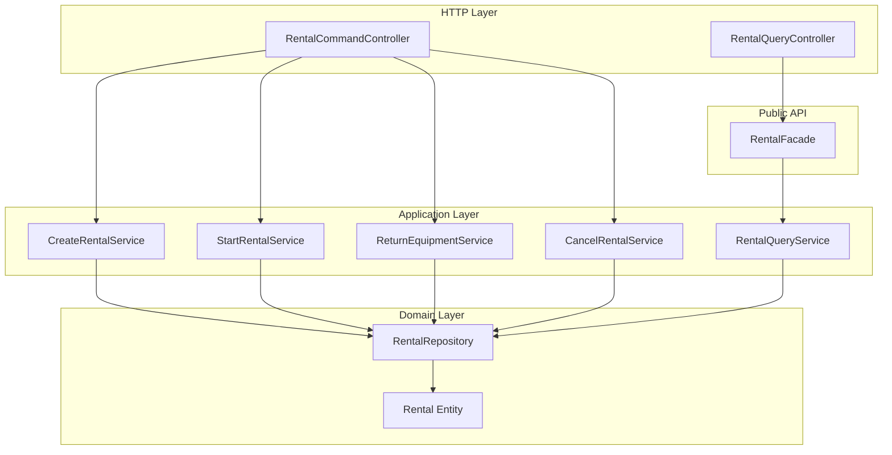

# Обновленная структура модуля Rental согласно архитектуре

# Детальная структура модуля на примере Rental

## Общая концепция слоев

Каждый модуль в Spring Modulith следует многоуровневой архитектуре с четкими границами:

```
┌────────────────────────────────────────────────────────────────┐
│              web (REST API)                                    │  ← Входная точка (HTTP)
├────────────────────────────────────────────────────────────────┤
│         application (Use Cases)                                │  ← Бизнес-сценарии
├────────────────────────────────────────────────────────────────┤
│      domain (Domain repository interface & Business Logic)     │  ← Бизнес-логика
├────────────────────────────────────────────────────────────────┤
│      infrastructure (Persistant, adapter)                      │  ← Инфраструктура (БД, MessageBroker, Cache )
├────────────────────────────────────────────────────────────────┤
│        event (Public DTO events)                               │  ← Интерфейс для других модулей
└────────────────────────────────────────────────────────────────┘
```

---

## Полная структура модуля Rental

```
com.github.jenkaby.bikerental.rental/
│
├── package-info.java                       # @ApplicationModule + @NamedInterfaces
│
├── RentalFacade.java                       # PUBLIC - Facade для других модулей
├── RentalInfo.java                         # PUBLIC - DTO для других модулей
│
├── event/                                  # PUBLIC (через @NamedInterface)
│   ├── RentalStarted.java
│   ├── RentalCompleted.java
│   └── RentalCancelled.java
│
│
├── domain/
│   ├── model/
│   │   ├── Rental.java                 # Aggregate Root (чистый POJO)
│   │   ├── RentalStatus.java           # Enum
│   │   └── vo/                         # Value Objects
│   │       ├── RentTime.java
│   │       ├── PayAmount.java
│   │       ├── RentalId.java
│   │       └── CustomerId.java
│   │
│   └── repository/
│       └── RentalRepository.java       # Domain repository interface
│
├── application/
│   ├── usecase/                        # UseCase интерфейсы
│   │   ├── CreateRentalUseCase.java
│   │   ├── StartRentalUseCase.java
│   │   ├── ReturnEquipmentUseCase.java
│   │   ├── CancelRentalUseCase.java
│   │   └── RentalQueryUseCase.java
│   │
│   ├── service/                        # Реализации UseCase
│   │   ├── CreateRentalService.java
│   │   ├── StartRentalService.java
│   │   ├── ReturnEquipmentService.java
│   │   ├── CancelRentalService.java
│   │   └── RentalQueryService.java
│   │
│   ├── port/                           # Ports (абстракции)
│   │   ├── DomainEventPublisher.java
│   │   └── ClockService.java
│   │
│   └── mapper/
│       └── RentalMapper.java           # MapStruct: domain ↔ Public DTO
│
├── infrastructure/
│   ├── persistence/
│   │   ├── entity/
│   │   │   └── RentalJpaEntity.java
│   │   ├── repository/
│   │   └── RentalJpaRepository.java
│   │   ├── adapter/
│   │   │   └── RentalRepositoryAdapter.java
│   │   └── mapper/
│   │       └── RentalJpaMapper.java    # MapStruct: domain ↔ JPA
│   │
│   ├── event/
│   │   └── SpringDomainEventPublisher.java
│   │
│   └── time/
│       └── SystemClockService.java
│
└── web/
│       ├── command/                        # Command контроллеры
│       │   ├── RentalCommandController.java
│       │   ├── dto/
│       │   │   ├── CreateRentalRequest.java
│       │   │   ├── StartRentalRequest.java
│       │   │   ├── ReturnEquipmentRequest.java
│       │   │   └── CancelRentalRequest.java
│       │   └── mapper/
│       │       └── RentalCommandMapper.java  # MapStruct: Web DTO ↔ UseCase Command
│       │
│       └── query/                          # Query контроллеры
│           ├── RentalQueryController.java
│           ├── dto/
│           │   └── RentalResponse.java
│           └── mapper/
│               └── RentalQueryMapper.java    # MapStruct: RentalInfo ↔ Web Response
```

---

## 1. Публичный API (корень модуля)

### 1.1 package-info.java

```java
/**
 * Модуль управления арендой оборудования.
 * 
 * Публичный API:
 * - {@link com.github.jenkaby.bikerental.rental.RentalFacade}
 * - {@link com.github.jenkaby.bikerental.rental.RentalInfo}
 * - События в пакете event
 */
@ApplicationModule(
    displayName = "Rental Management",
    allowedDependencies = {"client", "equipment", "tariff"}
)
@NamedInterfaces({
    @NamedInterface(name = "events", packages = "event")
})
package com.github.jenkaby.bikerental.rental;

import org.springframework.modulith.ApplicationModule;
import org.springframework.modulith.NamedInterface;
import org.springframework.modulith.NamedInterfaces;
```

### 1.2 RentalFacade.java

```java
package com.github.jenkaby.bikerental.rental;

import java.util.List;
import java.util.Optional;
import java.util.UUID;

/**
 * Публичный фасад модуля Rental.
 * Единственная точка входа для других модулей.
 */
public interface RentalFacade {
    
    Optional<RentalInfo> findById(Long rentalId);
    
    List<RentalInfo> findActiveRentals();
    
    Optional<RentalInfo> findActiveByEquipmentId(Long equipmentId);
    
    List<RentalInfo> findByCustomerId(UUID customerId);
}
```

### 1.3 RentalInfo.java

```java
package com.github.jenkaby.bikerental.rental;

import java.math.BigDecimal;
import java.time.ZonedDateTime;
import java.util.UUID;

/**
 * Публичное представление аренды для других модулей.
 */
public record RentalInfo(
    Long rentalId,
    UUID customerId,
    Long equipmentId,
    String status,
    ZonedDateTime startedAt,
    ZonedDateTime expectedReturnAt,
    ZonedDateTime actualReturnAt,
    BigDecimal prepaidAmount,
    BigDecimal surchargeAmount
) {
}
```

### 1.4 События (event пакет)

```java
package com.github.jenkaby.bikerental.rental.event;

import java.math.BigDecimal;
import java.time.ZonedDateTime;
import java.util.UUID;

public record RentalStarted(
    Long rentalId,
    UUID customerId,
    Long equipmentId,
    ZonedDateTime startedAt,
    BigDecimal prepaidAmount,
    ZonedDateTime occurredAt
) {
}
```

```java
package com.github.jenkaby.bikerental.rental.event;

import java.math.BigDecimal;
import java.time.ZonedDateTime;

public record RentalCompleted(
    Long rentalId,
    Long equipmentId,
    ZonedDateTime returnedAt,
    BigDecimal surchargeAmount,
    ZonedDateTime occurredAt
) {
}
```

```java
package com.github.jenkaby.bikerental.rental.event;

import java.time.ZonedDateTime;

public record RentalCancelled(
    Long rentalId,
    Long equipmentId,
    ZonedDateTime cancelledAt,
    String reason,
    ZonedDateTime occurredAt
) {
}
```

---

## 2. Web Layer - Command Controller

### 2.1 RentalCommandController.java

```java
package com.github.jenkaby.bikerental.rental.internal.web.command;

import com.github.jenkaby.bikerental.rental.internal.application.usecase.*;
import com.github.jenkaby.bikerental.rental.internal.web.command.dto.*;
import com.github.jenkaby.bikerental.rental.internal.web.command.mapper.RentalCommandMapper;

import jakarta.validation.Valid;
import org.springframework.http.HttpStatus;
import org.springframework.http.ResponseEntity;
import org.springframework.web.bind.annotation.*;

/**
 * REST API для команд (изменения состояния аренды).
 * Endpoints согласно backend-architecture.md:
 * - POST /api/rentals
 * - POST /api/rentals/{id}/start
 * - POST /api/rentals/{id}/return
 * - POST /api/rentals/{id}/cancel
 */
@RestController
@RequestMapping("/api/rentals")
class RentalCommandController {
    
    private final CreateRentalUseCase createRentalUseCase;
    private final StartRentalUseCase startRentalUseCase;
    private final ReturnEquipmentUseCase returnEquipmentUseCase;
    private final CancelRentalUseCase cancelRentalUseCase;
    private final RentalCommandMapper mapper;
    
    RentalCommandController(
        CreateRentalUseCase createRentalUseCase,
        StartRentalUseCase startRentalUseCase,
        ReturnEquipmentUseCase returnEquipmentUseCase,
        CancelRentalUseCase cancelRentalUseCase,
        RentalCommandMapper mapper
    ) {
        this.createRentalUseCase = createRentalUseCase;
        this.startRentalUseCase = startRentalUseCase;
        this.returnEquipmentUseCase = returnEquipmentUseCase;
        this.cancelRentalUseCase = cancelRentalUseCase;
        this.mapper = mapper;
    }
    
    /**
     * POST /api/rentals - Создание аренды
     */
    @PostMapping
    public ResponseEntity<Long> createRental(
        @Valid @RequestBody CreateRentalRequest request
    ) {
        var command = mapper.toCreateCommand(request);
        Long rentalId = createRentalUseCase.execute(command);
        return ResponseEntity.status(HttpStatus.CREATED).body(rentalId);
    }
    
    /**
     * POST /api/rentals/{id}/start - Запуск аренды
     */
    @PostMapping("/{id}/start")
    public ResponseEntity<Void> startRental(@PathVariable Long id) {
        var command = new StartRentalUseCase.StartRentalCommand(id);
        startRentalUseCase.execute(command);
        return ResponseEntity.ok().build();
    }
    
    /**
     * POST /api/rentals/{id}/return - Возврат оборудования
     */
    @PostMapping("/{id}/return")
    public ResponseEntity<ReturnEquipmentResponse> returnEquipment(@PathVariable Long id) {
        var command = new ReturnEquipmentUseCase.ReturnEquipmentCommand(id);
        var result = returnEquipmentUseCase.execute(command);
        var response = mapper.toReturnResponse(result);
        return ResponseEntity.ok(response);
    }
    
    /**
     * POST /api/rentals/{id}/cancel - Отмена аренды
     */
    @PostMapping("/{id}/cancel")
    public ResponseEntity<Void> cancelRental(
        @PathVariable Long id,
        @RequestBody(required = false) CancelRentalRequest request
    ) {
        String reason = request != null ? request.reason() : "Отмена по запросу клиента";
        var command = new CancelRentalUseCase.CancelRentalCommand(id, reason);
        cancelRentalUseCase.execute(command);
        return ResponseEntity.ok().build();
    }
}
```

### 2.2 Command DTOs

**CreateRentalRequest.java**:

```java
package com.github.jenkaby.bikerental.rental.internal.web.command.dto;

import jakarta.validation.constraints.NotNull;
import java.util.UUID;

public record CreateRentalRequest(
    @NotNull UUID customerId,
    @NotNull String equipmentNumber,
    @NotNull String rentalPeriod  // "HOUR_1", "HOUR_2", "DAY"
) {}
```

**ReturnEquipmentResponse.java**:

```java
package com.github.jenkaby.bikerental.rental.internal.web.command.dto;

import java.math.BigDecimal;

public record ReturnEquipmentResponse(
    Long rentalId,
    int actualMinutes,
    boolean overtimeForgiven,
    BigDecimal surcharge
) {}
```

**CancelRentalRequest.java**:

```java
package com.github.jenkaby.bikerental.rental.internal.web.command.dto;

public record CancelRentalRequest(String reason) {}
```

### 2.3 RentalCommandMapper.java

```java
package com.github.jenkaby.bikerental.rental.internal.web.command.mapper;

import com.github.jenkaby.bikerental.rental.internal.application.usecase.CreateRentalUseCase;
import com.github.jenkaby.bikerental.rental.internal.application.usecase.ReturnEquipmentUseCase;
import com.github.jenkaby.bikerental.rental.internal.web.command.dto.*;

import org.mapstruct.Mapper;
import org.mapstruct.MappingConstants;

@Mapper(componentModel = MappingConstants.ComponentModel.SPRING)
public interface RentalCommandMapper {
    
    CreateRentalUseCase.CreateRentalCommand toCreateCommand(CreateRentalRequest request);
    
    ReturnEquipmentResponse toReturnResponse(ReturnEquipmentUseCase.ReturnResult result);
    
    default CreateRentalUseCase.RentalPeriod mapRentalPeriod(String period) {
        return CreateRentalUseCase.RentalPeriod.valueOf(period);
    }
}
```

---

## 3. Web Layer - Query Controller

### 3.1 RentalQueryController.java

```java
package com.github.jenkaby.bikerental.rental.internal.web.query;

import com.github.jenkaby.bikerental.rental.RentalInfo;
import com.github.jenkaby.bikerental.rental.internal.application.usecase.RentalQueryUseCase;
import com.github.jenkaby.bikerental.rental.internal.web.query.dto.RentalResponse;
import com.github.jenkaby.bikerental.rental.internal.web.query.mapper.RentalQueryMapper;

import org.springframework.http.ResponseEntity;
import org.springframework.web.bind.annotation.*;

import java.util.List;

/**
 * REST API для запросов (чтение данных об арендах).
 * 
 * Использует RentalQueryUseCase напрямую, т.к. находится внутри модуля Rental.
 * Facade (RentalFacade) используется только внешними модулями.
 * 
 * Endpoint согласно backend-architecture.md:
 * - GET /api/rentals/active
 */
@RestController
@RequestMapping("/api/rentals")
class RentalQueryController {
    
    private final RentalQueryUseCase rentalQueryUseCase;  // ✅ Прямое использование UseCase
    private final RentalQueryMapper mapper;
    
    RentalQueryController(RentalQueryUseCase rentalQueryUseCase, RentalQueryMapper mapper) {
        this.rentalQueryUseCase = rentalQueryUseCase;
        this.mapper = mapper;
    }
    
    /**
     * GET /api/rentals/active - Список активных аренд
     */
    @GetMapping("/active")
    public ResponseEntity<List<RentalResponse>> getActiveRentals() {
        List<RentalInfo> rentals = rentalQueryUseCase.findActiveRentals();  // ✅ Прямой вызов UseCase
        List<RentalResponse> responses = rentals.stream()
            .map(mapper::toResponse)
            .toList();
        return ResponseEntity.ok(responses);
    }
    
    /**
     * GET /api/rentals/{id} - Получение аренды по ID
     * (дополнительный endpoint для удобства)
     */
    @GetMapping("/{id}")
    public ResponseEntity<RentalResponse> getRental(@PathVariable Long id) {
        return rentalQueryUseCase.findById(id)  // ✅ Прямой вызов UseCase
            .map(mapper::toResponse)
            .map(ResponseEntity::ok)
            .orElse(ResponseEntity.notFound().build());
    }
}
```

### 3.2 RentalResponse.java

```java
package com.github.jenkaby.bikerental.rental.internal.web.query.dto;

import java.math.BigDecimal;
import java.time.ZonedDateTime;
import java.util.UUID;

public record RentalResponse(
    Long id,
    UUID customerId,
    Long equipmentId,
    String status,
    ZonedDateTime startedAt,
    ZonedDateTime expectedReturnAt,
    ZonedDateTime actualReturnAt,
    BigDecimal prepaidAmount,
    BigDecimal surchargeAmount,
    BigDecimal totalAmount
) {}
```

### 3.3 RentalQueryMapper.java

```java
package com.github.jenkaby.bikerental.rental.internal.web.query.mapper;

import com.github.jenkaby.bikerental.rental.RentalInfo;
import com.github.jenkaby.bikerental.rental.internal.web.query.dto.RentalResponse;

import org.mapstruct.Mapper;
import org.mapstruct.Mapping;
import org.mapstruct.MappingConstants;

@Mapper(componentModel = MappingConstants.ComponentModel.SPRING)
public interface RentalQueryMapper {
    
    @Mapping(source = "rentalId", target = "id")
    @Mapping(target = "totalAmount", expression = "java(calculateTotal(rentalInfo))")
    RentalResponse toResponse(RentalInfo rentalInfo);
    
    default java.math.BigDecimal calculateTotal(RentalInfo info) {
        java.math.BigDecimal total = info.prepaidAmount();
        if (info.surchargeAmount() != null) {
            total = total.add(info.surchargeAmount());
        }
        return total;
    }
}
```

---

## 4. Facade Implementation

### 4.1 RentalFacadeImpl.java

```java
package com.github.jenkaby.bikerental.rental;

import com.github.jenkaby.bikerental.rental.internal.application.usecase.RentalQueryUseCase;
import org.springframework.stereotype.Service;

import java.util.List;
import java.util.Optional;
import java.util.UUID;

/**
 * Реализация фасада модуля Rental.
 */
@Service
class RentalFacadeImpl implements RentalFacade {
    
    private final RentalQueryUseCase rentalQueryUseCase;
    
    RentalFacadeImpl(RentalQueryUseCase rentalQueryUseCase) {
        this.rentalQueryUseCase = rentalQueryUseCase;
    }
    
    @Override
    public Optional<RentalInfo> findById(Long rentalId) {
        return rentalQueryUseCase.findById(rentalId);
    }
    
    @Override
    public List<RentalInfo> findActiveRentals() {
        return rentalQueryUseCase.findActiveRentals();
    }
    
    @Override
    public Optional<RentalInfo> findActiveByEquipmentId(Long equipmentId) {
        return rentalQueryUseCase.findActiveByEquipmentId(equipmentId);
    }
    
    @Override
    public List<RentalInfo> findByCustomerId(UUID customerId) {
        return rentalQueryUseCase.findByCustomerId(customerId);
    }
}
```

---

## 5. Сравнение с архитектурой

| Аспект | Архитектура (docs/backend-architecture.md) | Обновленная структура |

|--------|-------------------------------------------|----------------------|

| **Публичный API** | `api/` пакет | Facade в корне модуля |

| **Контроллер** | Один `RentalController` | Разделение: Command + Query |

| **Эндпоинты** | POST /api/rentals, POST /api/rentals/{id}/start, POST /api/rentals/{id}/return, POST
/api/rentals/{id}/cancel, GET /api/rentals/active | Точно такие же |

| **UseCase** | Классы в application | Интерфейсы + Service реализации |

| **Зависимости контроллера** | Не указано | Command: 5, Query: 2 |

---

## 6. Преимущества обновленной структуры

1. **Меньше зависимостей в контроллерах**: Command (5), Query (2) вместо 6 в одном
2. **CQRS разделение**: Команды и запросы разделены
3. **Facade Pattern**: Четкий публичный API для других модулей
4. **Соответствие архитектуре**: Эндпоинты точно по спецификации
5. **Все улучшения**: MapStruct, Repository Pattern, Value Objects, UseCase интерфейсы

---

## 7. Диаграмма потоков



---

## Правила использования Facade vs UseCase

### Когда использовать UseCase напрямую

**Внутренние компоненты модуля Rental:**

- Controllers (Command и Query)
- Другие UseCase внутри модуля
- Application сервисы внутри модуля

**Причина:** Нет необходимости в дополнительном слое абстракции, т.к. все находится в одном модуле.

### Когда использовать Facade

**Внешние модули:**

- Finance модуль
- Reporting модуль
- Maintenance модуль
- Любые другие модули, которым нужен доступ к Rental

**Причина:** Facade - это публичный контракт модуля, обеспечивающий:

- Стабильность API (внутренняя реализация может меняться)
- Инкапсуляцию (скрывает детали реализации)
- Соблюдение границ модулей Spring Modulith

---

## Итого

Обновленная структура модуля Rental:

- Соответствует архитектуре по эндпоинтам
- Использует Facade в корне модуля (вместо api пакета)
- Разделяет Command и Query контроллеры
- Применяет все улучшения: MapStruct, Repository Pattern, Value Objects, UseCase интерфейсы, ClockService,
  DomainEventPublisher
- Использует Long ID (кроме Customer UUID) и ZonedDateTime