# User Stories для системы BikeRental

**Версия документа:** 1.0  
**Дата создания:** 2026-01-21  
**Источник:** Функциональные требования из `docs/functional-and-non-functional-requirements.md`

---

## Содержание

1. [Модуль Customer (Управление клиентами)](#1-модуль-customer-управление-клиентами)
2. [Модуль Equipment (Управление оборудованием)](#2-модуль-equipment-управление-оборудованием)
3. [Модуль Rental (Процесс аренды)](#3-модуль-rental-процесс-аренды)
4. [Модуль Tariff (Тарификация и расчеты)](#4-модуль-tariff-тарификация-и-расчеты)
5. [Модуль Finance (Финансовые операции)](#5-модуль-finance-финансовые-операции)
6. [Модуль Reporting (Отчетность и аналитика)](#6-модуль-reporting-отчетность-и-аналитика)
7. [Модуль Maintenance (Техническое обслуживание)](#7-модуль-maintenance-техническое-обслуживание)
8. [Модуль Admin (Администрирование)](#8-модуль-admin-администрирование)

---

## 1. Модуль Customer (Управление клиентами)

### US-CL-001: Поиск клиента по номеру телефона

**Как** Оператор проката  
**Я хочу** найти клиента по последним 4 цифрам телефона  
**Чтобы** быстро идентифицировать клиента при оформлении аренды

**Описание:**  
Система должна предоставлять возможность поиска клиента по частичному совпадению номера телефона.

**Критерии приемки:**
- Ввод 4 цифр возвращает всех клиентов с совпадением
- Поддержка поиска от 4 до 11 цифр
- Время отклика < 1 секунды
- Поиск работает в режиме реального времени (при вводе)
- Система отображает список всех совпадений

**Приоритет:** Высокий  
**Модуль:** customer  
**Связанные требования:** FR-CL-001

---

### US-CL-002: Быстрое создание клиента

**Как** Оператор проката  
**Я хочу** быстро создать профиль клиента только с номером телефона  
**Чтобы** не задерживать процесс оформления аренды при отсутствии клиента в системе

**Описание:**  
Система должна позволять быстро создать профиль клиента с минимальными данными (только номер телефона).

**Критерии приемки:**
- Возможность создания клиента только с номером телефона
- Валидация формата номера телефона
- Автоматическое присвоение уникального ID клиента
- Время создания < 2 секунд

**Приоритет:** Высокий  
**Модуль:** customer  
**Связанные требования:** FR-CL-002

---

### US-CL-003: Полное создание/редактирование профиля клиента

**Как** Оператор проката  
**Я хочу** вводить и редактировать полную информацию о клиенте  
**Чтобы** иметь полный профиль клиента для улучшения качества обслуживания

**Описание:**  
Система должна предоставлять возможность ввода и редактирования полной информации о клиенте.

**Поля профиля:**
- Номер телефона (обязательное)
- Имя
- Фамилия
- Email
- Дата рождения
- Комментарии
- Дата регистрации (автоматически)

**Критерии приемки:**
- Все поля доступны для редактирования кроме даты регистрации
- Валидация email и телефона
- Сохранение истории изменений

**Приоритет:** Высокий  
**Модуль:** customer  
**Связанные требования:** FR-CL-003

---

### US-CL-004: История аренд клиента

**Как** Оператор проката / Бухгалтерия  
**Я хочу** просматривать историю всех аренд клиента  
**Чтобы** видеть полную информацию о взаимодействии клиента с сервисом

**Описание:**  
Система должна отображать историю всех аренд клиента.

**Критерии приемки:**
- Список всех аренд с датами начала и окончания
- Информация об арендованном оборудовании
- Сумма оплаты и доплат
- Статус аренды (активная, завершена, отменена)
- Возможность фильтрации по периоду

**Приоритет:** Низкий  
**Модуль:** customer  
**Связанные требования:** FR-CL-004

---

### US-CL-005: Статистика по клиенту

**Как** Оператор проката / Администратор  
**Я хочу** видеть статистику использования услуг клиентом  
**Чтобы** понимать ценность клиента и его поведение

**Описание:**  
Система должна показывать статистику использования услуг клиентом.

**Показатели:**
- Общее количество аренд
- Общая сумма оплат
- Средняя длительность аренды
- Дата последней аренды
- Статус лояльности (новый/постоянный)

**Критерии приемки:**
- Все показатели отображаются в карточке клиента
- Статистика рассчитывается автоматически
- Статус лояльности определяется на основе количества аренд

**Приоритет:** Низкий  
**Модуль:** customer  
**Связанные требования:** FR-CL-005

---

## 2. Модуль Equipment (Управление оборудованием)

### US-EQ-001: Справочник оборудования

**Как** Администратор  
**Я хочу** управлять справочником всего прокатного оборудования  
**Чтобы** вести учет всего парка оборудования

**Описание:**  
Система должна поддерживать справочник всего прокатного оборудования.

**Атрибуты оборудования:**
- Уникальный ID
- Порядковый номер (для визуального поиска)
- QR-код (UID)
- Тип оборудования (велосипед, самокат, другое)
- Модель/название
- Статус (доступно, в аренде, на обслуживании, списано)
- Дата ввода в эксплуатацию
- Техническое состояние

**Критерии приемки:**
- Возможность добавления нового оборудования
- Редактирование данных оборудования
- Поиск по порядковому номеру и QR-коду
- Фильтрация по типу и статусу

**Приоритет:** Высокий  
**Модуль:** equipment  
**Связанные требования:** FR-EQ-001

---

### US-EQ-002: Добавление оборудования по порядковому номеру

**Как** Оператор проката  
**Я хочу** добавить оборудование в аренду по его порядковому номеру  
**Чтобы** быстро находить оборудование без сканирования QR-кода

**Описание:**  
Система должна позволять добавить оборудование в аренду по его порядковому номеру.

**Критерии приемки:**
- Возможность ввода порядкового номера
- Проверка статуса "доступно"
- Отображение информации об оборудовании после выбора
- Время отклика < 1 секунды
- Поддержка автодополнения при вводе

**Приоритет:** Высокий  
**Модуль:** equipment  
**Связанные требования:** FR-EQ-002

---

### US-EQ-003: Сканирование метки при возврате

**Как** Оператор проката  
**Я хочу** сканировать метку оборудования при возврате  
**Чтобы** автоматически идентифицировать возвращаемое оборудование

**Описание:**  
Система должна поддерживать считывание меток оборудования через мобильное устройство при возврате.

**Критерии приемки:**
- Поддержка камеры мобильного устройства
- Автоматическое сопоставление UID с оборудованием
- Пометка оборудования как возвращенного
- Обработка ошибок (метка не найдена, оборудование не в аренде)

**Приоритет:** Высокий  
**Модуль:** equipment  
**Связанные требования:** FR-EQ-003

---

### US-EQ-004: Управление статусами оборудования

**Как** Система / Оператор проката / Администратор  
**Я хочу** управлять статусами оборудования  
**Чтобы** отслеживать состояние каждого оборудования и его доступность

**Описание:**  
Система должна управлять статусами оборудования и автоматически менять их.

**Статусы:**
- **Доступно** — готово к аренде
- **В аренде** — находится у клиента
- **На обслуживании** — на ремонте/ТО
- **Списано** — выведено из эксплуатации

**Переходы статусов:**
- Доступно → В аренде (при оформлении аренды)
- В аренде → Доступно (при возврате)
- Доступно → На обслуживании (ручное переключение)
- На обслуживании → Доступно (после завершения ТО)
- Любой статус → Списано (при списании)

**Критерии приемки:**
- Автоматическое изменение статуса при оформлении/возврате аренды
- Возможность ручного изменения статуса администратором
- Валидация переходов статусов

**Приоритет:** Высокий  
**Модуль:** equipment  
**Связанные требования:** FR-EQ-004

---

### US-EQ-005: Учет износа и пробега

**Как** Технический персонал  
**Я хочу** видеть информацию об износе и пробеге оборудования  
**Чтобы** планировать техническое обслуживание

**Описание:**  
Система должна автоматически учитывать время использования и пробег оборудования.

**Показатели:**
- Общее время в аренде (часы)
- Количество аренд
- Дата последнего ТО
- Следующее плановое ТО (по времени использования)

**Критерии приемки:**
- Автоматический подсчет времени использования
- Отображение в карточке оборудования
- Уведомления о необходимости ТО

**Приоритет:** Низкий  
**Модуль:** equipment  
**Связанные требования:** FR-EQ-005

---

## 3. Модуль Rental (Процесс аренды)

### US-RN-001: Создание записи аренды

**Как** Оператор проката  
**Я хочу** создать новую запись аренды  
**Чтобы** оформить аренду оборудования клиенту

**Описание:**  
Система должна позволять оператору создать новую запись аренды.

**Последовательность действий:**
1. Поиск/создание клиента
2. Выбор оборудования по порядковому номеру
3. Выбор времени аренды (1 час, 2 часа, сутки и т.д.)
4. Автоматический подбор тарифа
5. Расчет предварительной стоимости
6. Внесение предоплаты
7. Запуск аренды

**Критерии приемки:**
- Все шаги выполняются последовательно
- Невозможно пропустить обязательные шаги
- Сохранение черновика аренды

**Приоритет:** Высокий  
**Модуль:** rental  
**Связанные требования:** FR-RN-001

---

### US-RN-002: Автоматический подбор тарифа

**Как** Оператор проката  
**Я хочу** чтобы система автоматически подбирала тариф  
**Чтобы** не тратить время на ручной выбор тарифа

**Описание:**  
Система должна автоматически подбирать тариф на основе типа оборудования и выбранного времени аренды.

**Критерии приемки:**
- После выбора оборудования и времени система показывает тариф
- Отображение стоимости за выбранный период
- Возможность ручного изменения тарифа (для администратора)
- Тариф зависит от типа оборудования (велосипед/самокат/другое)

**Приоритет:** Высокий  
**Модуль:** rental  
**Связанные требования:** FR-RN-002

---

### US-RN-003: Установка даты и времени начала проката

**Как** Оператор проката  
**Я хочу** фиксировать точное время начала аренды  
**Чтобы** корректно рассчитывать стоимость аренды

**Описание:**  
Система должна фиксировать точное время начала аренды.

**Критерии приемки:**
- Фиксация времени с точностью до секунды
- Автоматическое заполнение текущим временем
- Возможность редактирования (например, если клиент оформлял аренду заранее)

**Приоритет:** Высокий  
**Модуль:** rental  
**Связанные требования:** FR-RN-003

---

### US-RN-004: Внесение предоплаты

**Как** Оператор проката  
**Я хочу** внести предоплату за аренду  
**Чтобы** зафиксировать оплату перед запуском аренды

**Описание:**  
Система должна позволять внести предоплату за аренду.

**Критерии приемки:**
- Указание суммы предоплаты
- Фиксация способа оплаты (наличные, карта)
- Формирование чека/квитанции
- Сохранение в финансовой истории

**Приоритет:** Высокий  
**Модуль:** rental  
**Связанные требования:** FR-RN-004

---

### US-RN-005: Запуск аренды

**Как** Оператор проката  
**Я хочу** активировать аренду после внесения предоплаты  
**Чтобы** начать отсчет времени аренды

**Описание:**  
Система должна активировать аренду после внесения предоплаты.

**Действия системы:**
- Изменение статуса аренды на "Активна"
- Изменение статуса оборудования на "В аренде"
- Фиксация времени начала
- Расчет ожидаемого времени возврата

**Критерии приемки:**
- Невозможность удалить активную аренду
- Отображение активной аренды в списке текущих
- Оборудование недоступно для новых аренд

**Приоритет:** Высокий  
**Модуль:** rental  
**Связанные требования:** FR-RN-005

---

### US-RN-006: Возврат оборудования

**Как** Оператор проката  
**Я хочу** обработать возврат оборудования клиентом  
**Чтобы** завершить аренду и рассчитать итоговую стоимость

**Описание:**  
Система должна обрабатывать процесс возврата оборудования клиентом.

**Последовательность действий:**

1. Сканирование метки оборудования
2. Автоматическое определение аренды
3. Фиксация времени возврата
4. Расчет фактического времени аренды
5. Расчет итоговой стоимости
6. Расчет доплаты (если есть)
7. Прием доплаты (если требуется)
8. Закрытие аренды

**Критерии приемки:**
- Автоматический расчет всех показателей
- Отображение детализации стоимости
- Формирование итогового чека

**Приоритет:** Высокий  
**Модуль:** rental  
**Связанные требования:** FR-RN-006

---

### US-RN-007: Расчет времени аренды

**Как** Система  
**Я хочу** автоматически рассчитывать фактическое время аренды  
**Чтобы** корректно определить стоимость аренды

**Описание:**  
Система должна автоматически рассчитывать фактическое время аренды.

**Критерии приемки:**
- Точный расчет времени между началом и возвратом
- Расчет времени с кратностью 5 минут
- Округление вверх (например, 23 минуты = 25 минут)
- Отображение в понятном формате (часы, минуты)

**Приоритет:** Высокий  
**Модуль:** rental  
**Связанные требования:** FR-RN-007

---

### US-RN-008: Ранний возврат или замена оборудования

**Как** Оператор проката  
**Я хочу** вернуть деньги при раннем возврате или заменить оборудование  
**Чтобы** обеспечить гибкость в обслуживании клиентов

**Описание:**  
Система должна поддерживать возврат денег при раннем возврате или замене оборудования.

**Критерии приемки:**
- Автоматическая проверка времени с начала аренды
- Если прошло менее 10 минут - возможность отмены аренды
- Возможность замены оборудования без доплаты
- Фиксация причины возврата
- Полный возврат денег или перенос на новое оборудование

**Приоритет:** Средний  
**Модуль:** rental  
**Связанные требования:** FR-RN-008

---

### US-RN-009: Просмотр активных аренд

**Как** Оператор проката / Администратор  
**Я хочу** видеть список всех активных аренд  
**Чтобы** контролировать текущие аренды и отслеживать просрочки

**Описание:**  
Система должна отображать список всех активных аренд.

**Информация в списке:**
- Клиент (имя, телефон)
- Оборудование
- Время начала
- Ожидаемое время возврата
- Время просрочки (если есть)
- Статус (в срок / просрочено)

**Критерии приемки:**
- Обновление в реальном времени
- Цветовая индикация просрочек
- Быстрый доступ к возврату
- Фильтрация по оборудованию/клиенту

**Приоритет:** Высокий  
**Модуль:** rental  
**Связанные требования:** FR-RN-009

---

## 4. Модуль Tariff (Тарификация и расчеты)

### US-TR-001: Справочник тарифов

**Как** Администратор  
**Я хочу** управлять справочником тарифов  
**Чтобы** настраивать цены на аренду для разных типов оборудования и периодов

**Описание:**  
Система должна содержать справочник тарифов для разных типов оборудования и времени аренды.

**Структура тарифа:**
- Название тарифа
- Тип оборудования
- Время аренды (1 час, 2 часа, сутки и т.д.)
- Стоимость базового периода
- Стоимость дополнительного времени (за 5 минут)
- Период действия тарифа (с даты / по дату)

**Критерии приемки:**
- Создание и редактирование тарифов
- Множественные тарифы для одного типа оборудования
- Версионирование тарифов
- Активация/деактивация тарифов

**Приоритет:** Высокий  
**Модуль:** tariff  
**Связанные требования:** FR-TR-001

---

### US-TR-002: Расчет стоимости аренды

**Как** Система  
**Я хочу** автоматически рассчитывать стоимость аренды  
**Чтобы** определить итоговую сумму к оплате с учетом фактического времени

**Описание:**  
Система должна автоматически рассчитывать стоимость аренды на основе тарифа и фактического времени.

**Бизнес-правило:**
- Расчет с кратностью 5 минут
- Если фактическое время <= запланированного + 7 минут — стоимость не меняется
- Если превышение > 7 минут — начисляется доплата

**Критерии приемки:**
- Автоматический расчет при возврате
- Отображение детализации расчета
- Правильное применение правила "прощения"

**Приоритет:** Высокий  
**Модуль:** tariff  
**Связанные требования:** FR-TR-002

---

### US-TR-003: Правило "прощения" просрочки

**Как** Система  
**Я хочу** применять правило "прощения" для небольших просрочек  
**Чтобы** не наказывать клиентов за незначительные задержки

**Описание:**  
Система должна применять правило "прощения" для небольших просрочек.

**Критерии приемки:**
- Просрочка до 7 минут включительно не тарифицируется
- Клиент платит только оплаченную сумму
- Просрочка отображается, но не влияет на стоимость
- Автоматическое применение правила
- Отображение сообщения "Просрочка прощена"
- Сохранение информации о просрочке в истории

**Приоритет:** Высокий  
**Модуль:** tariff  
**Связанные требования:** FR-TR-003

---

### US-TR-004: Расчет доплаты за просрочку

**Как** Система  
**Я хочу** рассчитывать доплату при превышении времени аренды  
**Чтобы** справедливо компенсировать дополнительное время использования

**Описание:**  
Система должна рассчитывать доплату при превышении времени аренды более чем на 7 минут.

**Критерии приемки:**
- Просрочка > 7 минут округляется до 10 минут
- Далее просрочка рассчитывается с кратностью 5 минут
- Применяется тариф доп. времени из справочника
- Правильное округление просрочки
- Детализированный расчет
- Отображение клиенту

**Приоритет:** Высокий  
**Модуль:** tariff  
**Связанные требования:** FR-TR-004

---

### US-TR-005: Возврат средств при отмене

**Как** Оператор проката  
**Я хочу** выполнить возврат средств при отмене в течение 10 минут  
**Чтобы** обеспечить справедливое обслуживание клиентов

**Описание:**  
Система должна выполнять возврат средств при отмене или замене в течение 10 минут.

**Критерии приемки:**
- Автоматическая проверка времени с начала аренды
- Если прошло <= 10 минут - возврат полной суммы предоплаты
- Или перенос на новое оборудование без доплаты
- Формирование документа на возврат
- Учет в финансовой отчетности
- Изменение статуса аренды на "Отменена"

**Приоритет:** Средний  
**Модуль:** tariff  
**Связанные требования:** FR-TR-005

---

## 5. Модуль Finance (Финансовые операции)

### US-FN-001: Прием оплаты

**Как** Оператор проката  
**Я хочу** фиксировать все платежи от клиентов  
**Чтобы** вести учет финансовых операций

**Описание:**  
Система должна фиксировать все платежи от клиентов.

**Типы платежей:**
- Предоплата при оформлении аренды
- Доплата при возврате
- Оплата аксессуаров/дополнительных услуг

**Способы оплаты:**
- Наличные
- Банковская карта
- Электронные платежи (QR-код)

**Критерии приемки:**
- Выбор способа оплаты
- Ввод суммы
- Формирование чека
- Сохранение в журнале операций

**Приоритет:** Высокий  
**Модуль:** finance  
**Связанные требования:** FR-FN-001

---

### US-FN-002: Возврат средств

**Как** Оператор проката  
**Я хочу** обрабатывать возвраты денежных средств клиентам  
**Чтобы** корректно учитывать все финансовые операции

**Описание:**  
Система должна обрабатывать возвраты денежных средств клиентам.

**Случаи возврата:**
- Отмена аренды в течение 10 минут
- Технические проблемы с оборудованием
- Ошибки оператора

**Критерии приемки:**
- Указание причины возврата
- Выбор способа возврата (соответствует способу оплаты)
- Формирование документа возврата
- Связь с исходной операцией оплаты

**Приоритет:** Высокий  
**Модуль:** finance  
**Связанные требования:** FR-FN-002

---

### US-FN-003: Финансовая история по аренде

**Как** Оператор проката / Бухгалтерия  
**Я хочу** видеть полную финансовую историю каждой аренды  
**Чтобы** отслеживать все платежи и возвраты по аренде

**Описание:**  
Система должна хранить полную финансовую историю каждой аренды.

**Информация:**
- Предоплата (сумма, способ, дата/время)
- Доплата (сумма, способ, дата/время)
- Возвраты (сумма, причина, дата/время)
- Итоговая сумма
- Статус оплаты

**Критерии приемки:**
- Хронологический список всех операций
- Детализация по типам операций
- Связь с чеками/документами

**Приоритет:** Средний  
**Модуль:** finance  
**Связанные требования:** FR-FN-003

---

### US-FN-004: Касса оператора

**Как** Оператор проката / Администратор  
**Я хочу** вести кассу для каждого оператора  
**Чтобы** контролировать наличные средства и сверять смены

**Описание:**  
Система должна вести кассу для каждого оператора (наличные средства).

**Операции:**
- Открытие смены (начальная сумма)
- Прием наличных
- Выдача наличных (возвраты)
- Изъятие наличных (инкассация)
- Закрытие смены

**Критерии приемки:**
- Учет всех наличных операций
- Автоматический расчет остатка кассы
- Сверка фактических и учетных данных
- Акт приема-передачи смены

**Приоритет:** Средний  
**Модуль:** finance  
**Связанные требования:** FR-FN-004

---

## 6. Модуль Reporting (Отчетность и аналитика)

### US-RP-001: Отчет по доходам за период

**Как** Администратор  
**Я хочу** формировать отчет о доходах за выбранный период  
**Чтобы** анализировать финансовые показатели бизнеса

**Описание:**  
Система должна формировать отчет о доходах за выбранный период.

**Показатели:**
- Общая сумма доходов
- Доходы по типам оборудования
- Доходы по тарифам
- Количество аренд
- Средний чек
- Доплаты за просрочки
- Возвраты

**Критерии приемки:**
- Выбор периода (день, неделя, месяц, произвольный)
- Экспорт в Excel/PDF
- Графическое представление данных
- Сравнение с предыдущим периодом

**Приоритет:** Низкий  
**Модуль:** reporting  
**Связанные требования:** FR-RP-001

---

### US-RP-002: Отчет по загрузке оборудования

**Как** Администратор / Технический персонал  
**Я хочу** видеть статистику использования каждой единицы оборудования  
**Чтобы** оптимизировать парк оборудования и планировать закупки

**Описание:**  
Система должна показывать статистику использования каждой единицы оборудования.

**Показатели по единице:**
- Общее время в аренде (часы)
- Количество аренд за период
- Процент загрузки от общего времени
- Доход от единицы оборудования
- Время простоя

**Критерии приемки:**
- Список всего оборудования с показателями
- Сортировка по загрузке
- Выявление недозагруженного оборудования
- Экспорт отчета

**Приоритет:** Низкий  
**Модуль:** reporting  
**Связанные требования:** FR-RP-002

---

### US-RP-003: Финансовая сверка для бухгалтерии

**Как** Бухгалтерия  
**Я хочу** получать детальный финансовый отчет  
**Чтобы** вести бухгалтерский учет и сверять данные

**Описание:**  
Система должна формировать детальный финансовый отчет для бухгалтерского учета.

**Содержание отчета:**
- Все операции прихода/расхода
- Разбивка по способам оплаты
- Наличные/безналичные
- Открытые/закрытые смены
- Акты сверки касс
- Незакрытые аренды

**Критерии приемки:**
- Соответствие бухгалтерским стандартам
- Детализация до уровня операции
- Экспорт в формате Excel
- Возможность выгрузки в учетные системы (1С)

**Приоритет:** Средний  
**Модуль:** reporting  
**Связанные требования:** FR-RP-003

---

### US-RP-004: Аналитика по клиентам

**Как** Администратор  
**Я хочу** получать аналитическую информацию о клиентах  
**Чтобы** понимать клиентскую базу и планировать маркетинговые активности

**Описание:**  
Система должна предоставлять аналитическую информацию о клиентах.

**Показатели:**
- ТОП клиентов по количеству аренд
- ТОП клиентов по сумме оплат
- Новые клиенты за период
- Вернувшиеся клиенты
- Средняя частота аренды
- Сегментация клиентов (новые/постоянные/VIP)

**Критерии приемки:**
- Визуализация данных
- Фильтрация по периодам
- Экспорт списка клиентов по сегментам

**Приоритет:** Низкий  
**Модуль:** reporting  
**Связанные требования:** FR-RP-004

---

### US-RP-005: Дашборд оператора

**Как** Оператор проката / Администратор  
**Я хочу** видеть основные показатели текущего дня на главном экране  
**Чтобы** быстро оценить текущую ситуацию

**Описание:**  
Система должна отображать основные показатели текущего дня на главном экране.

**Показатели:**
- Количество активных аренд
- Количество просроченных аренд
- Доход за сегодня
- Количество новых клиентов
- Доступное оборудование (по типам)
- Оборудование на обслуживании

**Критерии приемки:**
- Обновление в реальном времени
- Визуальные индикаторы
- Быстрые действия (кнопки)

**Приоритет:** Средний  
**Модуль:** reporting  
**Связанные требования:** FR-RP-005

---

## 7. Модуль Maintenance (Техническое обслуживание)

### US-MT-001: Планирование технического обслуживания

**Как** Технический персонал / Администратор  
**Я хочу** автоматически планировать техническое обслуживание  
**Чтобы** поддерживать оборудование в рабочем состоянии

**Описание:**  
Система должна автоматически планировать техническое обслуживание на основе времени использования.

**Критерии планирования ТО:**
- Каждые X часов работы (настраивается для типа оборудования)
- Каждые Y аренд
- По календарю (раз в месяц/квартал)

**Критерии приемки:**
- Автоматический расчет даты следующего ТО
- Уведомления о приближении срока ТО
- Уведомления о просроченном ТО
- Блокировка оборудования с просроченным критическим ТО

**Приоритет:** Низкий  
**Модуль:** maintenance  
**Связанные требования:** FR-MT-001

---

### US-MT-002: Учет ремонтов и обслуживания

**Как** Технический персонал  
**Я хочу** фиксировать все виды работ по обслуживанию оборудования  
**Чтобы** вести историю обслуживания и планировать расходы

**Описание:**  
Система должна фиксировать все виды работ по обслуживанию оборудования.

**Информация о работах:**
- Дата начала/завершения
- Тип работ (плановое ТО, ремонт, диагностика)
- Описание выполненных работ
- Замененные детали/компоненты
- Стоимость работ и запчастей
- Исполнитель

**Критерии приемки:**
- Создание записи о ТО
- История всех ТО по оборудованию
- Статистика затрат на обслуживание
- Интеграция со справочником запчастей (опционально)

**Приоритет:** Низкий  
**Модуль:** maintenance  
**Связанные требования:** FR-MT-002

---

### US-MT-003: Вывод оборудования из эксплуатации

**Как** Администратор  
**Я хочу** выводить оборудование из эксплуатации  
**Чтобы** исключить неисправное или устаревшее оборудование из парка

**Описание:**  
Система должна позволять выводить оборудование из эксплуатации (списание).

**Причины списания:**
- Износ
- Поломка без возможности ремонта
- Моральное устаревание
- Утеря/кража

**Критерии приемки:**
- Изменение статуса на "Списано"
- Указание причины и даты списания
- Исключение из доступного оборудования
- Сохранение истории использования
- Учет в отчетности

**Приоритет:** Низкий  
**Модуль:** maintenance  
**Связанные требования:** FR-MT-003

---

### US-MT-004: Уведомления о технических проблемах

**Как** Технический персонал  
**Я хочу** получать уведомления о проблемах с оборудованием  
**Чтобы** своевременно реагировать на неисправности

**Описание:**  
Система должна отправлять уведомления техническому персоналу о проблемах с оборудованием.

**Триггеры уведомлений:**
- Оборудование требует планового ТО
- Оборудование просрочило ТО
- Оператор отметил неисправность при возврате
- Высокая частота ранних возвратов (признак проблемы)

**Критерии приемки:**
- Email/SMS уведомления
- Уведомления в системе
- Приоритизация уведомлений

**Приоритет:** Низкий  
**Модуль:** maintenance  
**Связанные требования:** FR-MT-004

---

## 8. Модуль Admin (Администрирование)

### US-AD-001: Управление пользователями

**Как** Администратор  
**Я хочу** управлять учетными записями пользователей  
**Чтобы** контролировать доступ к системе

**Описание:**  
Система должна предоставлять возможность управления учетными записями пользователей.

**Действия:**
- Создание нового пользователя
- Редактирование данных пользователя
- Назначение ролей
- Блокировка/разблокировка пользователя
- Сброс пароля

**Роли:**
- Администратор
- Оператор проката
- Технический персонал
- Бухгалтерия (только чтение отчетов)

**Критерии приемки:**
- Список всех пользователей
- CRUD операции над пользователями
- Разграничение прав по ролям

**Приоритет:** Высокий  
**Модуль:** admin  
**Связанные требования:** FR-AD-001

---

### US-AD-002: Управление ролями и правами доступа

**Как** Администратор  
**Я хочу** управлять ролями и правами доступа  
**Чтобы** обеспечить безопасность системы и разграничить доступ

**Описание:**  
Система должна поддерживать ролевую модель доступа к функциям.

**Разрешения по ролям:**

**Оператор проката:**
- Создание/редактирование аренд
- Поиск/создание клиентов
- Возврат оборудования
- Прием оплаты
- Просмотр справочников (только чтение)

**Технический персонал:**
- Работа с оборудованием (ТО, ремонт)
- Изменение статусов оборудования
- Просмотр отчетов по загрузке

**Бухгалтерия:**
- Просмотр финансовых отчетов
- Экспорт данных
- Доступ к истории операций (только чтение)

**Администратор:**
- Полный доступ ко всем функциям
- Управление пользователями и настройками
- Изменение тарифов и бизнес-правил

**Критерии приемки:**
- Проверка прав при каждом действии
- Скрытие недоступных функций в UI
- Логирование попыток несанкционированного доступа

**Приоритет:** Средний  
**Модуль:** admin  
**Связанные требования:** FR-AD-002

---

### US-AD-003: Настройка тарифов

**Как** Администратор  
**Я хочу** создавать и изменять тарифы  
**Чтобы** управлять ценообразованием

**Описание:**  
Система должна позволять администратору создавать и изменять тарифы.

**Функции:**
- Создание нового тарифа
- Редактирование существующего
- Копирование тарифа
- Активация/деактивация
- Установка периода действия

**Критерии приемки:**
- Удобный интерфейс управления тарифами
- Валидация (цена > 0, корректные даты)
- Невозможность удалить тариф, используемый в активных арендах
- История изменений тарифов

**Приоритет:** Высокий  
**Модуль:** admin  
**Связанные требования:** FR-AD-003

---

### US-AD-004: Настройка бизнес-правил

**Как** Администратор  
**Я хочу** настраивать основные бизнес-параметры  
**Чтобы** адаптировать систему под бизнес-процессы

**Описание:**  
Система должна позволять настраивать основные бизнес-параметры.

**Настраиваемые параметры:**
- Кратность расчета времени (по умолчанию 5 минут)
- Порог "прощения" просрочки (по умолчанию 7 минут)
- Округление просрочки (по умолчанию 10 минут)
- Время для возврата денег при отмене (по умолчанию 10 минут)
- Периодичность ТО по умолчанию (для разных типов оборудования)

**Критерии приемки:**
- Интерфейс настроек
- Валидация значений (положительные числа, разумные диапазоны)
- Применение новых значений к новым арендам
- История изменений параметров

**Приоритет:** Средний  
**Модуль:** admin  
**Связанные требования:** FR-AD-004

---

### US-AD-005: Журнал аудита

**Как** Администратор  
**Я хочу** просматривать журнал всех значимых действий пользователей  
**Чтобы** отслеживать активность и обеспечивать безопасность

**Описание:**  
Система должна вести журнал всех значимых действий пользователей.

**Логируемые события:**
- Вход/выход пользователя
- Создание/изменение/удаление записей
- Изменение настроек
- Финансовые операции
- Попытки несанкционированного доступа

**Информация в журнале:**
- Дата/время
- Пользователь
- Тип события
- Описание действия
- Затронутые объекты (ID)
- IP-адрес (для веб-версии)

**Критерии приемки:**
- Автоматическое логирование
- Поиск и фильтрация по журналу
- Экспорт журнала
- Хранение не менее 1 года

**Приоритет:** Низкий  
**Модуль:** admin  
**Связанные требования:** FR-AD-005

---

### US-AD-006: Резервное копирование и восстановление

**Как** Администратор  
**Я хочу** создавать резервные копии данных и восстанавливать их  
**Чтобы** обеспечить сохранность данных

**Описание:**  
Система должна поддерживать резервное копирование данных.

**Функции:**
- Ручное создание резервной копии
- Автоматическое резервное копирование (настраивается)
- Восстановление из резервной копии
- Экспорт данных

**Критерии приемки:**
- Создание полной копии БД
- Восстановление с проверкой целостности
- Уведомления об успехе/ошибке
- Хранение копий в безопасном месте

**Приоритет:** Низкий  
**Модуль:** admin  
**Связанные требования:** FR-AD-006

---

## Итоговая статистика

**Всего User Stories:** 43

**По приоритетам:**
- Высокий: 24
- Средний: 9
- Низкий: 10

**По модулям:**

- Customer: 5
- Equipment: 5
- Rental: 9
- Tariff: 5
- Finance: 4
- Reporting: 5
- Maintenance: 4
- Admin: 6

---

## Граф зависимостей User Stories

### Диаграмма зависимостей

```mermaid
flowchart TD
    subgraph Core["Core Modules - Независимые"]
        CL001[US-CL-001<br/>Поиск клиента]
        CL002[US-CL-002<br/>Быстрое создание]
        CL003[US-CL-003<br/>Полное создание]
        EQ001[US-EQ-001<br/>Справочник оборудования]
        TR001[US-TR-001<br/>Справочник тарифов]
        FN001[US-FN-001<br/>Прием оплаты]
        AD001[US-AD-001<br/>Управление пользователями]
        AD006[US-AD-006<br/>Резервное копирование]
    end

    subgraph CustomerModule["Customer Module"]
        CL004[US-CL-004<br/>История аренд]
        CL005[US-CL-005<br/>Статистика]
    end

    subgraph EquipmentModule["Equipment Module"]
        EQ002[US-EQ-002<br/>Добавление по номеру]
        EQ003[US-EQ-003<br/>Сканирование метки]
        EQ004[US-EQ-004<br/>Статусы]
        EQ005[US-EQ-005<br/>Учет износа]
    end

    subgraph TariffModule["Tariff Module"]
        TR002[US-TR-002<br/>Расчет стоимости]
        TR003[US-TR-003<br/>Правило прощения]
        TR004[US-TR-004<br/>Расчет доплаты]
        TR005[US-TR-005<br/>Возврат при отмене]
    end

    subgraph RentalModule["Rental Module"]
        RN001[US-RN-001<br/>Создание аренды]
        RN002[US-RN-002<br/>Подбор тарифа]
        RN003[US-RN-003<br/>Время начала]
        RN004[US-RN-004<br/>Предоплата]
        RN005[US-RN-005<br/>Запуск аренды]
        RN006[US-RN-006<br/>Возврат]
        RN007[US-RN-007<br/>Расчет времени]
        RN008[US-RN-008<br/>Ранний возврат]
        RN009[US-RN-009<br/>Активные аренды]
    end

    subgraph FinanceModule["Finance Module"]
        FN002[US-FN-002<br/>Возврат средств]
        FN003[US-FN-003<br/>Финансовая история]
        FN004[US-FN-004<br/>Касса оператора]
    end

    subgraph ReportingModule["Reporting Module"]
        RP001[US-RP-001<br/>Отчет по доходам]
        RP002[US-RP-002<br/>Загрузка оборудования]
        RP003[US-RP-003<br/>Финансовая сверка]
        RP004[US-RP-004<br/>Аналитика клиентов]
        RP005[US-RP-005<br/>Дашборд]
    end

    subgraph MaintenanceModule["Maintenance Module"]
        MT001[US-MT-001<br/>Планирование ТО]
        MT002[US-MT-002<br/>Учет ремонтов]
        MT003[US-MT-003<br/>Списание]
        MT004[US-MT-004<br/>Уведомления]
    end

    subgraph AdminModule["Admin Module"]
        AD002[US-AD-002<br/>Роли и права]
        AD003[US-AD-003<br/>Настройка тарифов]
        AD004[US-AD-004<br/>Бизнес-правила]
        AD005[US-AD-005<br/>Журнал аудита]
    end

%% Customer dependencies
    CL001 --> RN001
    CL002 --> RN001
    RN001 --> CL004
    RN006 --> CL004
    CL004 --> CL005

    %% Equipment dependencies
    EQ001 --> EQ002
    EQ001 --> EQ003
    EQ001 --> EQ004
    EQ001 --> MT002
    RN005 --> EQ003
    RN006 --> EQ005
    EQ004 --> MT003
    EQ005 --> MT001
    EQ005 --> RP002

    %% Tariff dependencies
    TR001 --> RN001
    TR001 --> RN002
    TR001 --> AD003
    RN007 --> TR002
    TR001 --> TR002
    TR002 --> TR003
    TR002 --> TR004
    TR003 --> TR004
    RN006 --> TR002
    RN008 --> TR005
    FN002 --> TR005

    %% Rental dependencies
    EQ002 --> RN001
    RN001 --> RN003
    RN001 --> RN004
    RN001 --> RN005
    FN001 --> RN004
    RN004 --> RN005
    EQ004 --> RN005
    RN005 --> RN006
    RN005 --> RN008
    RN005 --> RN009
    EQ003 --> RN006
    RN003 --> RN007
    RN007 --> RN006
    TR002 --> RN006

    %% Finance dependencies
    FN001 --> FN002
    FN001 --> FN003
    FN001 --> FN004
    FN002 --> FN003
    FN002 --> FN004
    RN004 --> FN003
    RN006 --> FN003

    %% Reporting dependencies
    FN001 --> RP001
    FN002 --> RP001
    RN006 --> RP002
    FN003 --> RP003
    FN004 --> RP003
    CL005 --> RP004
    RN009 --> RP005
    FN001 --> RP005
    EQ001 --> RP005

    %% Maintenance dependencies
    MT001 --> MT004
    RN006 --> MT004

    %% Admin dependencies
    AD001 --> AD002
    AD001 --> AD004
    AD001 --> AD005
    TR001 --> AD003

    style CL001 fill:#e1f5e1
    style CL002 fill:#e1f5e1
    style CL003 fill:#e1f5e1
    style EQ001 fill:#e1f5e1
    style TR001 fill:#e1f5e1
    style FN001 fill:#e1f5e1
    style AD001 fill:#e1f5e1
    style AD006 fill:#e1f5e1
```

### Легенда

- **Зеленый цвет** - независимые stories (можно начинать сразу)
- **Стрелки** - направление зависимости (A → B означает, что B зависит от A)

---

## Порядок выполнения User Stories

Список отсортирован с учетом зависимостей и приоритетов. Stories с одинаковым уровнем зависимостей можно выполнять параллельно.

### Phase 1: Фундамент (Независимые Core Stories)

| № | ID        | Название                                       | Приоритет | Модуль    | Зависимости |
|---|-----------|------------------------------------------------|-----------|-----------|-------------|
| 1 | US-CL-001 | Поиск клиента по номеру телефона               | Высокий   | customer  | -           |
| 2 | US-CL-002 | Быстрое создание клиента                       | Высокий   | customer  | -           |
| 3 | US-CL-003 | Полное создание/редактирование профиля клиента | Высокий   | customer  | -           |
| 4 | US-EQ-001 | Справочник оборудования                        | Высокий   | equipment | -           |
| 5 | US-TR-001 | Справочник тарифов                             | Высокий   | tariff    | -           |
| 6 | US-FN-001 | Прием оплаты                                   | Высокий   | finance   | -           |
| 7 | US-AD-001 | Управление пользователями                      | Высокий   | admin     | -           |
| 8 | US-AD-006 | Резервное копирование и восстановление         | Низкий    | admin     | -           |

### Phase 2: Базовые функции модулей

| № | ID | Название | Приоритет | Модуль | Зависимости |
|---|----|----------|-----------|--------|-------------|
| 9 | US-EQ-002 | Добавление оборудования по порядковому номеру | Высокий | equipment | US-EQ-001 |
| 10 | US-EQ-004 | Управление статусами оборудования | Высокий | equipment | US-EQ-001 |
| 11 | US-FN-002 | Возврат средств | Высокий | finance | US-FN-001 |
| 12 | US-AD-002 | Управление ролями и правами доступа | Средний | admin | US-AD-001 |
| 13 | US-AD-003 | Настройка тарифов | Высокий | admin | US-TR-001 |
| 14 | US-AD-004 | Настройка бизнес-правил | Средний | admin | US-AD-001 |
| 15 | US-MT-002 | Учет ремонтов и обслуживания | Низкий | maintenance | US-EQ-001 |
| 16 | US-MT-003 | Вывод оборудования из эксплуатации | Низкий | maintenance | US-EQ-004 |

### Phase 3: Основной процесс аренды

| № | ID | Название | Приоритет | Модуль | Зависимости |
|---|----|----------|-----------|--------|-------------|
| 17 | US-RN-001 | Создание записи аренды | Высокий | rental | US-CL-001, US-CL-002, US-EQ-002, US-TR-001 |
| 18 | US-RN-002 | Автоматический подбор тарифа | Высокий | rental | US-TR-001 |
| 19 | US-RN-003 | Установка даты и времени начала проката | Высокий | rental | US-RN-001 |
| 20 | US-RN-004 | Внесение предоплаты | Высокий | rental | US-RN-001, US-FN-001 |
| 21 | US-RN-005 | Запуск аренды | Высокий | rental | US-RN-001, US-RN-004, US-EQ-004 |
| 22 | US-RN-007 | Расчет времени аренды | Высокий | rental | US-RN-003 |
| 23 | US-RN-009 | Просмотр активных аренд | Высокий | rental | US-RN-005 |

### Phase 4: Возврат и расчеты

| №  | ID        | Название                               | Приоритет | Модуль    | Зависимости                                |
|----|-----------|----------------------------------------|-----------|-----------|--------------------------------------------|
| 24 | US-TR-002 | Расчет стоимости аренды                | Высокий   | tariff    | US-TR-001, US-RN-007                       |
| 25 | US-TR-003 | Правило "прощения" просрочки           | Высокий   | tariff    | US-TR-002                                  |
| 26 | US-TR-004 | Расчет доплаты за просрочку            | Высокий   | tariff    | US-TR-002, US-TR-003                       |
| 27 | US-EQ-003 | Сканирование метки при возврате        | Высокий   | equipment | US-EQ-001, US-RN-005                       |
| 28 | US-RN-006 | Возврат оборудования                   | Высокий   | rental    | US-RN-005, US-EQ-003, US-RN-007, US-TR-002 |
| 29 | US-EQ-005 | Учет износа и пробега                  | Низкий    | equipment | US-RN-006                                  |
| 30 | US-RN-008 | Ранний возврат или замена оборудования | Средний   | rental    | US-RN-005                                  |
| 31 | US-TR-005 | Возврат средств при отмене             | Средний   | tariff    | US-RN-008, US-FN-002                       |

### Phase 5: Финансы и история

| №  | ID        | Название                     | Приоритет | Модуль   | Зависимости                                |
|----|-----------|------------------------------|-----------|----------|--------------------------------------------|
| 32 | US-FN-003 | Финансовая история по аренде | Средний   | finance  | US-FN-001, US-FN-002, US-RN-004, US-RN-006 |
| 33 | US-FN-004 | Касса оператора              | Средний   | finance  | US-FN-001, US-FN-002                       |
| 34 | US-CL-004 | История аренд клиента        | Низкий    | customer | US-RN-001, US-RN-006                       |
| 35 | US-CL-005 | Статистика по клиенту        | Низкий    | customer | US-CL-004                                  |

### Phase 6: Отчетность и аналитика

| № | ID | Название | Приоритет | Модуль | Зависимости |
|---|----|----------|-----------|--------|-------------|
| 36 | US-RP-001 | Отчет по доходам за период | Низкий | reporting | US-FN-001, US-FN-002 |
| 37 | US-RP-002 | Отчет по загрузке оборудования | Низкий | reporting | US-EQ-005, US-RN-006 |
| 38 | US-RP-003 | Финансовая сверка для бухгалтерии | Средний | reporting | US-FN-003, US-FN-004 |
| 39 | US-RP-004 | Аналитика по клиентам | Низкий | reporting | US-CL-005 |
| 40 | US-RP-005 | Дашборд оператора | Средний | reporting | US-RN-009, US-FN-001, US-EQ-001 |

### Phase 7: Техническое обслуживание

| № | ID | Название | Приоритет | Модуль | Зависимости |
|---|----|----------|-----------|--------|-------------|
| 41 | US-MT-001 | Планирование технического обслуживания | Низкий | maintenance | US-EQ-005 |
| 42 | US-MT-004 | Уведомления о технических проблемах | Низкий | maintenance | US-MT-001, US-RN-006 |

### Phase 8: Администрирование (финальные функции)

| № | ID | Название | Приоритет | Модуль | Зависимости |
|---|----|----------|-----------|--------|-------------|
| 43 | US-AD-005 | Журнал аудита | Низкий | admin | US-AD-001 |

---

## Рекомендации по планированию спринтов

### Sprint 1 (MVP Core) - 8 stories
- Все независимые core stories (Phase 1)
- Цель: Базовая инфраструктура и справочники

### Sprint 2 (Базовые функции) - 8 stories
- Phase 2: Базовые функции модулей
- Цель: Подготовка к основному процессу аренды

### Sprint 3 (Процесс аренды) - 7 stories
- Phase 3: Основной процесс аренды
- Цель: Возможность создавать и запускать аренды

### Sprint 4 (Возврат и расчеты) - 8 stories
- Phase 4: Возврат и расчеты
- Цель: Полный цикл аренды с расчетами

### Sprint 5 (Финансы и история) - 4 stories
- Phase 5: Финансы и история
- Цель: Полная финансовая отчетность

### Sprint 6 (Отчетность) - 5 stories
- Phase 6: Отчетность и аналитика
- Цель: Бизнес-аналитика

### Sprint 7 (Расширенные функции) - 3 stories
- Phase 7-8: ТО и администрирование
- Цель: Дополнительные функции

---

**Конец документа**
